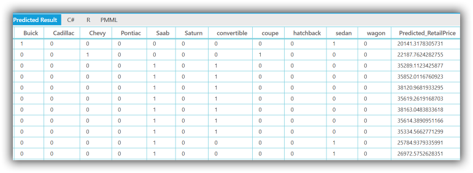

# Getting Started

This section provides you the basic information about getting started with predictive analytics, that is, how to create a model in R, generate a PMML file and finally, how to deploy it in a .NET application using the PMML Execution Engine.

Several samples are included with the product. Each sample contains R code that builds models from training data and serializes the model to PMML. The PMML file is also included for runtime use. C# code demonstrates consuming the PMML file using the PMML engine. The samples can be run by using the sample browser interface provided for several platforms including ASP.NET, MVC,  Windows Forms, WinRT and WPF. The individual samples can also be directly accessed from the following location, assuming it is the default install location. _%LOCALAPPDATA%\Syncfusion\EssentialStudio\%version%\Common\Analytics (assuming default install location)._

## Getting Started with R

R is a free software programming language and software environment for statistical computing and graphics. The R language is widely used among statisticians and data miners for developing statistical software and data analysis. R is freely available from [http://www.r-project.org/](http://www.r-project.org/).

Syncfusion has published an eBook titled “R Succinctly” that allows you to quickly get started with the R modeling environment. This book is included with the documentation for this product.

Once you build a model using R or any other modeling environment of your choice, you can export the model to PMML. The persisted model is then a stand-alone representation of the model that can then be interpreted at runtime by a suitable model such as the PMML engine. During deployment time there is no need for the original modeling environment or runtime to be present in any form.

With R, you can use the PMML package available from [http://cran.r-project.org/web/packages/pmml/index.html](http://cran.r-project.org/web/packages/pmml/index.html) to persist supported models to PMML. All it takes is one line of R code.

The following extract shows the creation of PMML in the Cars sample included with the product, under the category titled Regression. Default installation path is: _%LOCALAPPDATA%\Syncfusion\EssentialStudio\%version%\Common\Analytics\Regression\Cars._

PMML generation code is as follows.


# Load pmml package

library(pmml) 

....

# Applying Regression model

cars_Regression<-lm(Price~.,data=trainData)	 							 					 

....

# PMML generation

pmmlFile<-pmml(cars_Regression,data=trainData)

write(toString(pmmlFile),file="Cars.pmml")

saveXML(pmmlFile,file="Cars.pmml")


If you are modeling with an alternate environment such as SAS or SPSS, refer to that product’s documentation on the persistence of models to PMML. 

Once you have a PMML file that represents your model, you are ready to start the process of deployment.

The generated PMML file for the simple regression model illustrated in the sample is as follows.

## PMML File:



 <?xml version="1.0"?>

<PMML version="4.1" xmlns="http://www.dmg.org/PMML-4_1" xmlns:xsi="http://www.w3.org/2001/XMLSchema-instance" xsi:schemaLocation="http://www.dmg.org/PMML-4_1 http://www.dmg.org/v4-1/pmml-4-1.xsd">

 <Header copyright="Copyright (c) 2014 Syncfusion" description="Linear Regression Model">

  <Extension name="user" value="Syncfusion" extender="Rattle/PMML"/>

  <Application name="Rattle/PMML" version="1.4"/>

  <Timestamp>2014-07-17 12:38:17</Timestamp>

 </Header>

 <DataDictionary numberOfFields="18">

  <DataField name="Price" optype="continuous" dataType="double"/>

  <DataField name="Mileage" optype="continuous" dataType="double"/>

  <DataField name="Cylinder" optype="continuous" dataType="double"/>

  <DataField name="Doors" optype="continuous" dataType="double"/>

  <DataField name="Cruise" optype="continuous" dataType="double"/>

  <DataField name="Sound" optype="continuous" dataType="double"/>

  <DataField name="Leather" optype="continuous" dataType="double"/>

  <DataField name="Buick" optype="continuous" dataType="double"/>

  <DataField name="Cadillac" optype="continuous" dataType="double"/>

  <DataField name="Chevy" optype="continuous" dataType="double"/>

  <DataField name="Pontiac" optype="continuous" dataType="double"/>

  <DataField name="Saab" optype="continuous" dataType="double"/>

  <DataField name="Saturn" optype="continuous" dataType="double"/>

  <DataField name="convertible" optype="continuous" dataType="double"/>

  <DataField name="coupe" optype="continuous" dataType="double"/>

  <DataField name="hatchback" optype="continuous" dataType="double"/>

  <DataField name="sedan" optype="continuous" dataType="double"/>

  <DataField name="wagon" optype="continuous" dataType="double"/>

 </DataDictionary>

 <RegressionModel modelName="Linear_Regression_Model" functionName="regression" algorithmName="least squares">

  <MiningSchema>

   <MiningField name="Price" usageType="predicted"/>

   <MiningField name="Mileage" usageType="active"/>

   <MiningField name="Cylinder" usageType="active"/>

   <MiningField name="Doors" usageType="active"/>

   <MiningField name="Cruise" usageType="active"/>

   <MiningField name="Sound" usageType="active"/>

   <MiningField name="Leather" usageType="active"/>

   <MiningField name="Buick" usageType="active"/>

   <MiningField name="Cadillac" usageType="active"/>

   <MiningField name="Chevy" usageType="active"/>

   <MiningField name="Pontiac" usageType="active"/>

   <MiningField name="Saab" usageType="active"/>

   <MiningField name="Saturn" usageType="active"/>

   <MiningField name="convertible" usageType="active"/>

   <MiningField name="coupe" usageType="active"/>

   <MiningField name="hatchback" usageType="active"/>

   <MiningField name="sedan" usageType="active"/>

   <MiningField name="wagon" usageType="active"/>

  </MiningSchema>

  <Output>

   <OutputField name="Predicted_Price" feature="predictedValue"/>

  </Output>

  <RegressionTable intercept="-1404.85634354542">

   <NumericPredictor name="Mileage" exponent="1" coefficient="-0.201340622164363"/>

   <NumericPredictor name="Cylinder" exponent="1" coefficient="3794.8236596627"/>

   <NumericPredictor name="Doors" exponent="1" coefficient="1588.3110092597"/>

   <NumericPredictor name="Cruise" exponent="1" coefficient="424.970769596581"/>

   <NumericPredictor name="Sound" exponent="1" coefficient="499.61577647855"/>

   <NumericPredictor name="Leather" exponent="1" coefficient="784.986438997019"/>

   <NumericPredictor name="Buick" exponent="1" coefficient="552.173111394673"/>

   <NumericPredictor name="Cadillac" exponent="1" coefficient="12611.32359635"/>

   <NumericPredictor name="Chevy" exponent="1" coefficient="-568.090998283941"/>

   <NumericPredictor name="Pontiac" exponent="1" coefficient="-1716.28817772575"/>

   <NumericPredictor name="Saab" exponent="1" coefficient="12439.5191213991"/>

   <NumericPredictor name="Saturn" exponent="1" coefficient="0"/>

   <NumericPredictor name="convertible" exponent="1" coefficient="10562.3973171046"/>

   <NumericPredictor name="coupe" exponent="1" coefficient="0"/>

   <NumericPredictor name="hatchback" exponent="1" coefficient="-6530.39136964952"/>

   <NumericPredictor name="sedan" exponent="1" coefficient="-4505.20249327318"/>

   <NumericPredictor name="wagon" exponent="1" coefficient="0"/>

  </RegressionTable>

 </RegressionModel>

</PMML>


This PMML file thus generated can then be used by the PMML Execution Engine along with input data to obtain predicted results.

The following code demonstrates predicting car prices using independent predictors, present in the model. The entire dataset is loaded and predictions are made.



[C#]

public Table PredictResult(string inputDataCSVPath, string pmmlPath)

        {

            //Load input csv

            inputTable = new Table(inputDataCSVPath, true, ',');

            //Get PMML Evaluator instance

            PMMLEvaluator evaluator = new PMMLEvaluatorFactory().

              GetPMMLEvaluatorInstance(pmmlPath);

            string[] predictedCategories = null;

            //Predict the value for each record using the PMML Evaluator instance

            for (int i = 0; i < inputTable.RowCount; i++)

            {

                var cars = GetDataObject(inputTable, i);

                //Get result

                PredictedResult predictedResult = evaluator.GetResult(cars, null);

                if (i == 0)

                {

                    //Get the predicted propability fields

                    predictedCategories = predictedResult.GetPredictedCategories();

                    //Initialize the output table

                    InitializeTable(inputTable.RowCount, predictedCategories);

                }

                //Add predicted value

                outputTable[i, 0] = predictedResult.PredictedValue;

            }

            return outputTable;

        }  

public object GetDataObject(Table inputTable, int row)

        {

            var cars = new

            {

                Price = inputTable[row, "Price"],

                Mileage = inputTable[row, "Mileage"],

                Cylinder = inputTable[row, "Cylinder"],

                Doors = inputTable[row, "Doors"],

                Cruise = inputTable[row, "Cruise"],

                Sound = inputTable[row, "Sound"],

                Leather = inputTable[row, "Leather"],

                Buick = inputTable[row, "Buick"],

                Cadillac = inputTable[row, "Cadillac"],

                Chevy = inputTable[row, "Chevy"],

                Pontiac = inputTable[row, "Pontiac"],

                Saab = inputTable[row, "Saab"],

                Saturn = inputTable[row, "Saturn"],

                convertible = inputTable[row, "convertible"],

                coupe = inputTable[row, "coupe"],

                hatchback = inputTable[row, "hatchback"],

                sedan = inputTable[row, "sedan"],

                wagon = inputTable[row, "wagon"]

            };

            return cars;

        }          


The output as it appears in the sample, is displayed in the following image.

