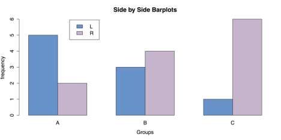
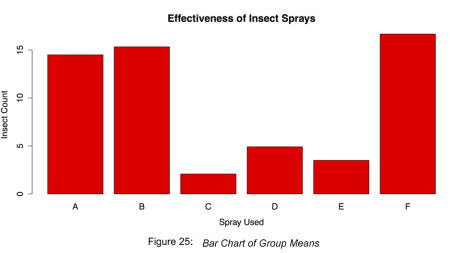
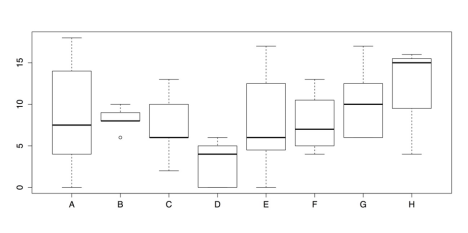
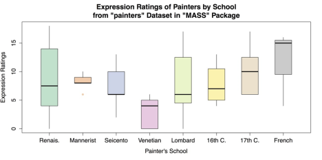
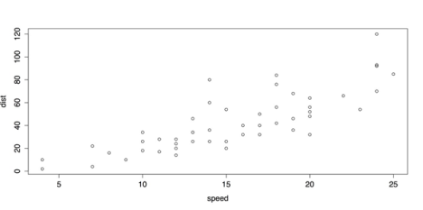
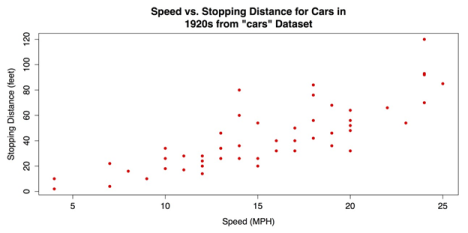
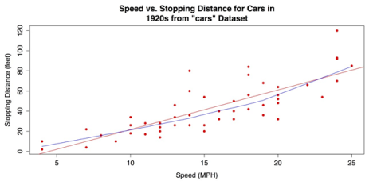
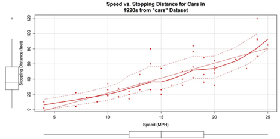

# Charts for Associations 

Graphics can provide vital context and insight to the analysis that could be easily lost if the statistical procedures came first. Accordingly, in the guidelines on univariate analysis, you learn about charts for one variable and then statistics for one variable. Following that pattern, you can learn about bivariate associations, with charts for association, and statistics for association. 

## Grouped Bar Charts of Frequencies 

When a dataset consists of joint categorizations based on two variables, grouped bar charts of the joint frequencies are often the most informative graph. In this section, begin by entering a small 2 x 3 table of data directly into R. This is done by nesting the read.table() function within the as.matrix() function. You have to convert the data to a matrix since the plotting functions that you use expect the data to be in vectors or matrices. In addition, two attributes are specified: header = TRUE, which indicates that the first row of data contains the names for the levels on the first categorical variable, and row.names = 1, which indicates that the first column contains the names for the levels on the second categorical variables. The data themselves consist of the frequencies for each combination of levels. 

### Sample: sample_6_1.R 



# ENTER DATA  

data1 <- as.matrix(read.table(   # Save as matrix          header = TRUE,  # First row is the header.          row.names = 1,  # First column is row names. 

         # No comments within the data. 

         text = ' 

         X  A  B  C 

         L  5  3  1 

         R  2  4  6          ')) data1  # Check the data.
		 
		 


The next step is to create the barplot using R’s barplot() function. The most important part of this command is the attribute beside = TRUE, which places the bars side-by-side instead of stacked.



# CREATE BARPLOT barplot(data1,  # Use a new summary table.         beside = TRUE,  # Bars side-by-side vs. stacked. 

        col = c("steelblue3", "thistle3"),  # Colors         main = "Side by Side Bar plots",         xlab = "Groups",         ylab = "frequency")
		
		
		 


It is possible to add a legend as an attribute in the barplot() command. However, an interesting alternative is to add the legend interactively. By first making the plot with the previous code and then executing the following code, the cursor changes to crosshairs and allows you to manually position the legend within the plot.



# ADD LEGEND INTERACTIVELY 
legend(locator(1),

# Use mouse to locate the legend.        
rownames(data1), 
 
# Use matrix row names (A & B).        
fill = c("steelblue3", "thistle3"))  

# Colors



### ADD LEGEND INTERACTIVELY 

The resulting grouped bar plot is shown in the following figure. 

Grouped Bar Chart for Frequencies
{:.caption}

As usual, once you have saved your work, you should clean the workspace by removing any variables or objects you created with rm(list = ls()). 

## Bar Charts of Group Means 

When data consist of quantitative data for several groups on a single categorical variable, then a bar chart of group means can be helpful. To create this chart in R, it is necessary to reorganize the raw data into a table of means, which can then be made into a chart with the same barplot() function that we used in the last section. In this example the InsectSprays data from R’s datasets package is used. 

### Sample: sample_6_2.R


# LOAD DATA require("datasets")  # Load the datasets package. spray <- InsectSprays  # Load data with shorter name.


In order to make a bar chart of means, you first need to save the means into their own object. You can do this with the aggregate() function, in which the outcome variable spray$count is a function of spray$spray and FUN = mean requests the means. 



# GET GROUP MEANS 

means <- aggregate(spray$count ~ spray$spray, FUN = mean) means  # Check the data.



The resulting data frame means consists of a column of index values and a column of means. You need to remove the column of names and transpose the means. You can do this with the transpose function t() and the argument [-1], which excludes the first column. You then put the group names back in as column names with the colnames() function and specifying mean[, 1], which calls for all rows of the first column. The transposed data and columns names are saved into a new object, mean.data. 



# REORGANIZE DATA FOR BARPLOT mean.data <- t(means[-1])  # Removes the first column, transposes the second. colnames(mean.data) <- means[, 1]  # Add group names as column names. mean.data



Once the data have been rearranged in this manner, all that remains is to call the barplot() function. 



# BARPLOT WITH DEFAULTS 
barplot(mean.data)



It is, however, useful to add some options to barplot(), especially to add titles and labels. 



# BARPLOT WITH OPTIONS barplot(mean.data,         col  = "red", 

        main = "Effectiveness of Insect Sprays",         xlab = "Spray Used",         ylab = "Insect Count")



This produces the chart shown in the following figure. 

Bar Chart of Group Means
{:.caption}

Finish by cleaning the workspace and removing any variables or objects you created. 



# CLEAN UP detach("package:datasets", unload = TRUE)  # Unloads the datasets package. rm(list = ls())  # Remove all objects from workspace.



## Grouped box plots 

Though bar charts can be useful, it shows only one piece of data, the mean, for each group. It may also be important to look at the entire distribution of scores for each group. This allows you to check for outliers by group as well as get an intuitive feel for how well your data meets statistical assumptions like homogeneity of variance. 

For this example is used the painters dataset from the MASS package. This dataset contains 18th century art critic Roger de Piles’ judgments of 54 classical painters on four characteristics: composition, drawing, color, and expression. The painters are classified according to their “school.” This is indicated by a factor level code as follows: "A": Renaissance; "B": Mannerist; "C": Seicento; "D": Venetian; "E": Lombard; "F": Sixteenth Century; "G": 

Seventeenth Century; "H": French. These classifications form the basis of the analysis. 

### Sample: sample_6_3.R 



# LOAD DATA 

# Use data set "painters" from the package "MASS" require("MASS") data(painters) painters[1:3, ]            Composition Drawing Color Expression School 

Da Udine            10       8     16          3      A 

Da Vinci            15      16      4         14      A 

Del Piombo           8      13     16          7      A



The dataset is well formatted and ready for use with R’s boxplot() function. All that is necessary is to specify the outcome variable and categorizing variable. In this case, these are painters$Expression and painters$School, respectively. 



# GROUPED BOXPLOTS WITH DEFAULTS 

# Draw boxplots of outcome (Expression) by group (School) boxplot(painters$Expression ~ painters$School)



The default box plot produced by this code is displayed in the following figure.

Grouped Box plots- Default Chart
{:.caption}

As a chart, the above figure has one glaring omission: the groups do not have meaningful labels. Instead, they are categorized as A, B, C, and so on. This defeats the purpose of the chart. Consequently, it is important to add those labels using the names() attribute. It is also a good idea to add titles, axis labels, and other changes to make the chart both more informative and more attractive. Part of this change involves using the RColorBrewer package to set colors for the box plots.



# GROUPED BOXPLOTS WITH OPTIONS require("RColorBrewer") boxplot(painters$Expression ~ painters$School,         col = brewer.pal(8, "Pastel2"),         names  = c("Renais.", 

                   "Mannerist", 

                   "Seicento", 

                   "Venetian", 

                   "Lombard", 

                   "16th C.", 

                   "17th C.", 

                   "French"),         boxwex = 0.5,  # Width of box as proportion of original. 

        whisklty = 1,  # Whisker line type; 1 = solid line         staplelty = 0,  # Staple (line at end) type; 0 = none.         outpch = 16,  # Symbols for outliers; 16 = filled circle.         outcol = brewer.pal(8, "Pastel2"),  # Color for outliers.         main = "Expression Ratings of Painters by School                from \"painters\" Data set in \"MASS\" Package",         xlab = "Painter's School",         ylab = "Expression Ratings")


Note that there is no + or other line break in main for the title; R observes the break in the code as a typographic instruction. The improved box plots are shown in the following figure. 

Grouped Box plots with Labels and Options
{:.caption}

Once you have saved your work, you should clean the workspace by removing any variables or objects you created. 



# CLEAN UP 

detach("package:MASS", unload = TRUE)  # Unloads MASS package detach("package:RColorBrewer", unload = TRUE)  # Unloads RColorBrewer package. rm(list = ls())  # Remove all objects from workspace.



## Scatter Plots 

Perhaps the most common and useful chart for visualizing the association between two variables is the scatter plot. Scatter plots are used when two variables are quantitative that is, interval or ratio level of measurement although they can be adapted to many other situations. In the base installation of R, the general-purpose plot() function is typically used for scatter plots. It works well both in its default configuration and with its several options. In addition, it is possible to overlay a variety of regression lines and smoothers. 

For this example, you can use cars data from R’s datasets package. 

###  Sample: sample_6_4.R 



# LOAD DATA require(“datasets”)  # Load datasets

 package. data(cars)


 
Because the cars dataset contains only two variables speed and dist (i.e., distance to stop from the corresponding speed) and both are quantitative, it is possible to have nothing more than the name of the dataset as an argument to the plot() function. 



# SCATTER PLOT WITH DEFAULTS plot(cars)


 
This produces the scatter plot as shown in the following screenshot.

Default Scatter Plot with plot()
{:.caption}

The above Default Scatter Plot with plot() is adequate, plot() also provides several options for labels and design. 



# SCATTER PLOT WITH OPTIONS plot(cars,      pch = 16,      col = "red", 

     main = "Speed vs. Stopping Distance for Cars in 

             1920s from \"cars\" Data set",      xlab = "Speed (MPH)", 

     ylab = "Stopping Distance (feet)") 

	 
	 
The revised scatter plot is shown in the following screenshot. 

Revised Scatter plot with plot()
{:.caption}

The upward pattern that indicates a positive association between the two variables in the above figure is easy to see. However, the relationship can be even clearer when fit lines are added. In the following code example, a linear regression line is overlaid with the abline() function that takes a linear regression model from the lm() function as its argument. In addition, a lowess line locally weighted scatter plot smoothing can be added with the lines() function that takes the lowess() function as its argument. See    ?abline, ?lines, and ?lowess for more information on these functions. 



# ADD REGRESSION & LOWESS # Linear regression line.

 abline(lm(cars$dist ~ cars$speed), col = "red")   # 

"locally weighted scatterplot smoothing"

 lines(lowess(cars$speed, cars$dist), col = "blue")



The scatter plot with the added fit lines is shown in the following screenshot. 

Scatter Plot with Linear Regression and Lowess Fit Lines
{:.caption}

For a final variation on the bivariate scatter plot, you can use the scatter plot() or sp() functions from the coincidentally named car package (that in this case, stands for "Companion to Applied Regression"). This package has many variations on scatter plots. You ca use the package that has marginal box plots, smoothers, and quantile regression intervals. See help(package = "car") for more information. 

First you can install and load the car package. 



# INSTALL & LOAD "CAR" PACKAGE install.packages("car")  #

 Download the package. require("car")  # Load the package.
 


Next, you can call the scatter plot function that can be called with scatter plot() or sp()— with a few attribute arguments to alter the dots and provide titles and labels. Otherwise, the code is closed to the default setup. 



# "CAR" SCATTERPLOT sp(cars$dist ~ cars$speed,  # Distance as a function of speed. 

   pch = 16,  # Points: solid circles. 

   col = "red",  # Red for graphic elements. 

   main = "Speed vs. Stopping Distance for Cars in 

           1920s from \"cars\" Data set",    xlab = "Speed (MPH)", 

   ylab = "Stopping Distance (feet)") 
   


The following screenshot shows the resulting chart. The marginal box plots, smoothers, and quantile regression intervals that are included by default, make this a very information-dense graphic.

Scatter Plot created with car Package 
{:.caption}

Once you have saved your work, clean the workspace by removing any variables or objects you created. 


  
# CLEAN UP detach("package:datasets", unload = TRUE)  # Unloads datasets package. detach("package:car", unload = TRUE)  # Unloads car package. rm(list = ls())  # Remove all objects from workspace.



