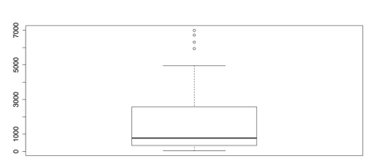

## Charts for One Variable 

As mentioned above, analyses are most useful when graphics come first, before the statistical procedures. In addition, the individual variables that form the basis of all later work need to be well understood and, if appropriate, adapted to the analytical needs. With those two points in mind, the following guidelines begins with charts for one variable. 

## Bar charts for categorical variables 

Once your data is in R, your first task in any analysis is to examine the individual variables. The purposes of this task are threefold: 

* To check that the data are correct. 
* To check whether the data meet the assumptions of the procedures you will use. 
* To check for interesting observations or patterns in the data. 

It is easiest to begin with categorical variables, such as a respondent's gender or a company's sector. Bar charts work well for such data.

For this example, you can use chickwts from R’s datasets package. This data set records the weights of chicks and the feed that they had. To see more on this dataset, enter “?chickwts”. To see the entire dataset in the console it has 71 cases enter chickwts. To make the plot, run the following two commands: 

## Sample: sample_2_1.R 


# LOAD DATA 

require(“datasets”)  # Loads data sets package



### Then run the default plot() command. 



# DEFAULT CHART WITH PLOT() 

plot(chickwts$feed)  # Default method to plot the variable feed from chickwts



### The default plot() function is adaptive. It produces different charts depending on what variables you give it. When you give it a categorical variable, it produces the bar chart as shown in the following figure. The argument, chickwts$feed, is a way of telling R to use the data set “chickwts” and then the variable “feed” from that dataset.

### You need to add titles, rearrange the bars, and change the margins, among other things. The default plot() function, though, does not provide much control. Instead, you need to use the barplot() function. But first, you need to calculate the frequencies for the chart. You can use the table() function for that:



# CREATE TABLE 

feeds <- table(chickwts$feed)  # Create a table of feed, place in “feeds” feeds  # See contents of object “feeds” 

barplot(feeds)  # Identical to plot(chickwts$feed) but with new object



### Now you can create a new chart using barplot(). Also you can adjust a few parameters with the par() function. Enter “?par” for more information. R gives you two choices for running multiline commands from the Script window. You can run one line at a time by pressing Command+Return on Mac and Ctrl+Return on Windows for each line. In this case, nothing will happen until you run the last line of the command. You can also highlight the block and run it at once with the same keyboard command. 



# USE BARPLOT() AND PAR() FOR PARAMETERS par(oma = c(1, 4, 1, 1))  # Sets outside margins: bottom, left, top, right. par(mar = c(4, 5, 2, 1))  # Sets plot margins. 

barplot(feeds[order(feeds)],  # Orders the bars by descending values. 

        horiz  = TRUE,  # Makes the bars horizontal.         las    = 1,  # las gives orientation of axis labels. 

        col    = c("beige", "blanchedalmond", "bisque1", "bisque2",                    "bisque3", "bisque4"),  # Vector of colors for bars.         border = NA,  # No borders on bars.         # Add main title and label for x-axis.         main   = "Frequencies of Different Feeds in chickwts Data set",         xlab   = "Number of Chicks")  



### This series of commands produce the modified bar chart as shown in the following figure. 

### Finish by saving your work, resetting the graphics parameters, and clearing the workspace of unwanted variables, objects, and packages:



# CLEAN UP par(oldpar)  # Restores previous parameters (ignore errors). 

detach("package:datasets", unload = TRUE)  # Unloads data sets package. rm(list = ls())  # Removes all objects from workspace.



## Saving charts in R and RStudio 

There are two ways to save charts so you can export them. The first method, is the default method for R, is cumbersome and confusing but you can include it in your code. The second method, uses RStudio, is much simpler but uses menus. Used here in the guidelines is the second method for all the images in this book. 

To save images using R's method, you must open a device or "graphical device." The following code shows how to use devices to save either PNG files for raster graphics or PDF files for vector graphics. You must use one or the other for the command; you cannot run both at once. There are also several other formats available. Refer ?png, ?pdf, and ?dev for more information on these functions. 

## Sample: sample_2_2.R



# CHOOSE GRAPHICS DEVICE 

# TO SAVE AS PNG 

# EITHER this device for a PNG file (raster graphics) png(filename = "~/Desktop/bar_a.png",  # Give the full path and name.     width = 900,  # Width of image in pixels.     height = 600)  # Height of image in pixels. 

# TO SAVE AS PDF 

# OR this device for a PDF file (scalable vector graphics) pdf("bar_b.pdf",  # Save to default directory or errors ensue.     width = 9,  # Width in inches (NOT pixels).     height = 6)  #Height in inches.



### After you have selected a graphics device and set the parameters, you can create the graphic. 



# CREATE GRAPHIC 

# Then run the command(s) for the graphic. 

oldpar <- par()  # Stores current graphical parameters. 

par(oma = c(1, 1, 1, 1))  # Sets outside margins: bottom, left, top, right. par(mar = c(4, 5, 2, 1))  # Sets plot margins. barplot(feeds[order(feeds)],  # Order the bars by descending values. 

        horiz  = TRUE,  # Make the bars horizontal. 

        las    = 1,  # las gives orientation of axis labels. 

        col    = c("beige", "blanchedalmond", "bisque1", "bisque2",                    "bisque3", "bisque4"),  # Vector of colors for bars         border = NA,  # No borders on bars.         # Add main title and label for x-axis.         main   = "Frequencies of Different Feeds\nin chickwts Data set",         xlab   = "Number of Chicks")   



### Once you have saved your work, you should clean the workspace of unneeded variables and objects. It is critical to turn off the graphics device with dev.off(). 



# CLEAN UP dev.off()  # Turns off graphics device. par(oldpar)  # Restores previous graphics parameters (ignore errors). rm(list = ls())  # Removes all objects from workspace.



### The graph is then saved without being displayed in RStudio. As a note, you received several error messages when you restore the previous graphical parameters with par(oldpar). These errors happen because a few of the parameters that were stored are read-only. These parameters are not modified so you can safely ignore these error messages. 

### This method with graphical devices has been found to be unreliable. For example, with the PNG device you must specify the full file path and save the image where you want it. But with the PDF device, the file does not open if you specify the path. Instead, you need to save the PDF to the default directory and then move it. Also, the devices do not always turn off as expected. When that happens, RStudio does not show new graphics in the Plots tab. You may need to restart RStudio to quit the devices completely. This is unnecessary frustration. 

### Hence you can use the second method for saving graphics,that uses RStudio’s menus. All that you need to do is to create the graphic as normal and RStudio displays it in the Plots tab. Then click the Export button at the top of the window. RStudio first asks you whether you want to save the plot as an image, as a PDF, or save it to the clipboard. It is a simple matter then to set the parameters in the window that opens. That way, you can choose the file type, the image size, and the location, among other attributes. 

## Pie charts 

A common way to display categorical variables is with pie charts. These are easy to make in R.

## Sample: sample_2_3.R 



# LOAD DATA SET & CREATE TABLE require(“datasets”)  # Loads data sets package.

feeds <- table(chickwts$feed)  # Create a table of feed, place in “feeds” feeds  # See contents of object “feeds”. 

# PIE CHART WITH DEFAULTS  pie(feeds) 



### The following figure shows the resulting chart.

### As with bar charts, it can be helpful to modify this pie chart in a few ways: 



# PIE CHART WITH OPTIONS pie(feeds[order(feeds, decreasing = TRUE)],  # Order slices by values.     init.angle = 90,  # Start as 12 o'clock instead of 3 o’clock.     clockwise = TRUE,  # Go clockwise (default is FALSE). 

    col = c("seashell", "cadetblue2", "lightpink", 

            "lightcyan", "plum1", "papayawhip"),  # Change colors)     main = "Pie Chart of Feeds from chickwts")  # Add title.



### This produces the improved pie chart in the following figure. 

### It is easy to make pie charts in R but it can be hard to read them. For example, the R Help on pie charts says this: 

### Pie charts are a very bad way of displaying information. The eye is good at judging linear measures and bad at judging relative areas. A bar chart or dot chart is a preferable way of displaying this type of data. 

Cleveland (1985), page 264: “Data that can be shown by pie charts always can be shown by a dot chart. This means that judgments of position along a common scale can be made instead of the less accurate angle judgments.” This statement is based on the empirical investigations of Cleveland and McGill as well as investigations by perceptual psychologists. 

Pie charts can be very hard to read accurately, defeating the purpose of a graph. It is difficult to read angles and the areas of circular sectors. Comparing heights or lengths of straight bars, though, is a very simple task. For this reason, it is a good idea to avoid pie charts whenever possible and instead choose a graphic that is easier to read and interpret. 

Once you have saved your work, you should clean the workspace of unwanted variables and objects: 



# CLEAN UP 

detach("package:datasets", unload = TRUE)  # Unloads data sets package rm(list = ls())  # Removes all objects from workspace



## Histograms 

When you have a quantitative variable, that is, an interval or ratio level variable, a histogram is useful. Interval and ratio level variables both have measurable distances between scores, whereas the lower levels of measurement, nominal and ordinal, do not. For example, temperature in Fahrenheit is an interval level of measurement because it is possible to say that the high temperature for today is 2.7 degrees higher than yesterday. On the other hand, if you use an ordinal level of measurement and just say that today is hotter than yesterday, giving it a relative position but not an absolute one, then you can’t find out how much difference there is between the two days. In order to make a histogram, you need to know how far apart your measurements are. Interval level variables like temperature in Fahrenheit or ratio level variables that have true zero points, like distance in meters, can both do that. In this example, the built-in data set "lynx" is used. Refer? lynx for more information. First you need to load the datasets package and then load the lynx dataset. 

## Sample: sample_2_4.R 



# LOAD DATA SET require(“datasets”) 

data(lynx)  # Annual Canadian Lynx trappings 1821-1934 



### lynx is a time series dataset with only one variable, so you can just call the dataset in the hist() function.



# HISTOGRAM WITH DEFAULTS  hist(lynx)



### This produces the following figure. 

### Figure 15 is a respectable chart, using nothing more than the default settings. The chart has a title, the axes have labels, the number and width of bars is reasonable, and even the plain black and white is clean and easy to read. R's hist() function, though, has many options. Here are a few of them: 



# HISTOGRAM WITH OPTIONS hist(lynx,      breaks = 14,  # "Suggests" 14 bins. 

     freq = FALSE,  # Axis shows density, not frequency.      col = "thistle1",  # Color for the histogram. 

     main = "Histogram of Annual Canadian Lynx Trappings\n1821-1934",      xlab = "Number of Lynx Trapped")  # Label X axis


This code produces the following figure.

### Aside from the obvious changes of color and titles, there are two modifications to explain further. The breaks attribute sets the number of bins to use, but it is more a suggestion than other attributes. This means R will look at the suggestion but use its own algorithm to calculate bin width. Used here is an argument of 14 bins in this case, which is what R did, but you would still get 14 bins if you entered 11 here. R's autonomy in this respect may be an advantage, but if you want more control, you can set the breaks by hand. You can use a regular sequence to set the breaks at a uniform distance, like this: breaks = seq(0, 7000, by = 100). You can also set each break by hand, like this: breaks = c(0, 100, 300, 500, 3000, 3500, 7000). However, it’s hard to imagine a situation where you would want to do that. 

### The other attribute I want to mention is freq = FALSE. By default, R labels the Y axis with bin frequencies. freq = FALSE changes the axis labels to density, or proportions. This does not change the shape of the distribution but it does allow one important addition. When the histogram is a density chart, it is possible to superimpose other distributions. It is then much easier to judge normality and identify important deviations. 

In the code that follows, add four plots to the histogram: 

* A normal distribution. 
* A kernel density estimate using the default bandwidth. 
* A kernel density estimate using an adjusted bandwidth. 
* A rug, or line plot, that appears underneath the distribution. 



# SUPERIMPOSED NORMAL DISTRIBUTION 

curve(dnorm(x, mean = mean(lynx), sd = sd(lynx)),  # Shape, mean, SD       col = "thistle4",  # Color of the curve.       lewd = 2,  # Line width of 2 pixels.

      add = TRUE)  # Superimpose on the previous graph. 

# SUPERIMPOSED KERNEL DENSITY ESTIMATES lines(density(lynx), col = "blue", lwd = 2) 

lines(density(lynx, adjust = 3), col = "darkgreen", lwd = 2)  

# SUPERIMPOSED RUG PLOT rug(lynx, lwd = 2) 



### In this case, the curve() function calls for a dnorm distribution, or normal density distribution. There are many other choices; refer “?curve” for more. The first line also uses two functions as arguments: mean = mean(lynx) and sd = sd(lynx). These functions match the curve's mean and standard deviation to the histogram's. This shortcut saves effort and rounding error. The kernel density estimates work on the empirical data, so there is no need to adjust parameters other than bandwidth. Refer “?kernel” for more. The rug mirrors the distribution. The result is displayed in the following figure. 

### Once you have saved your work, clean the workspace of unwanted variables and objects.



# CLEAN UP detach("package:datasets", unload = TRUE)  # Unloads data sets package. rm(list = ls())  # Remove all objects from workspace.



## Boxplots 

The last univariate chart explained here is the boxplot. Boxplots are well suited to identifying outliers in quantitative variables. The default boxplot is simple to create: 

## Sample: sample_2_5.R 


# LOAD DATA SET require(“datasets”)  # Load datasets package. data(lynx)  # Annual Canadian Lynx trappings 1821-1934. 

# BOXPLOT WITH DEFAULTS boxplot(lynx) 



### This command produces the rudimentary boxplot as displayed in the following figure. 

### The above figure would be better with labels and if it were horizontal. There are also several other options for boxplots: 



# BOXPLOT WITH OPTIONS  boxplot(lynx,         horizontal = TRUE,  # Draw boxplot horizontally.         las = 1,  # Make all labels horizontal.         notch = TRUE,  # Notches for CI for median.         col = "slategray3",   # Color for the central box.         boxwex = 0.5,  # Width of box as proportion of original. </td></tr>

        whisklty = 1,  # Whisker line type; 1 = solid line         staplelty = 0,  # Staple (line at end) type; 0 = none         outpch = 16,  # Symbols for outliers; 16 = filled circle         outcol = "slategray3",  # Color for outliers.         main = "Histogram of Annual Canadian Lynx Trappings\n1821-1934",         xlab = "Number of Lynx Trapped")  # Label the x-axis. </td></tr>



This produces the improved boxplot in the following figure. 

### The boxplot in the above figure emphasizes the asymmetry of the distribution as well as the gaps and outliers. This is important information for the statistical analyses.

### Once you have saved your work, you should clear the workspace of unwanted variables, objects, or packages.



# CLEAN UP detach("package:datasets", unload = TRUE)  # Unloads data sets package. rm(list = ls())  # Removes all objects from workspace.



