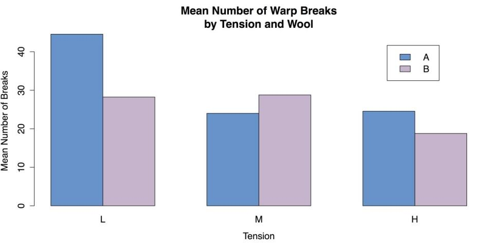
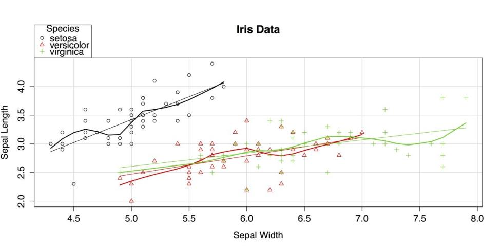
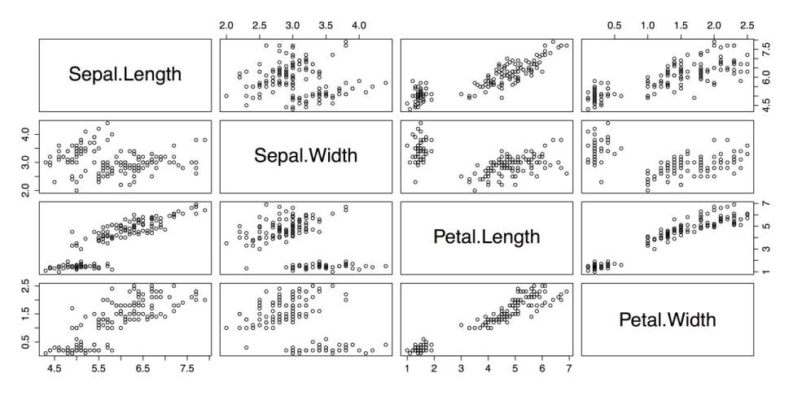
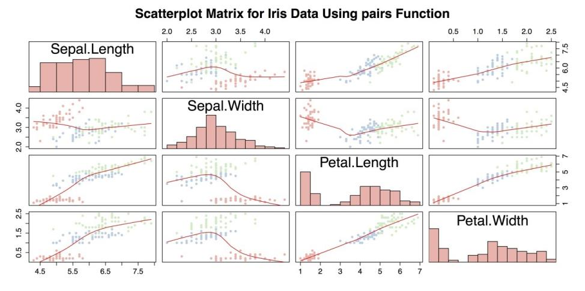
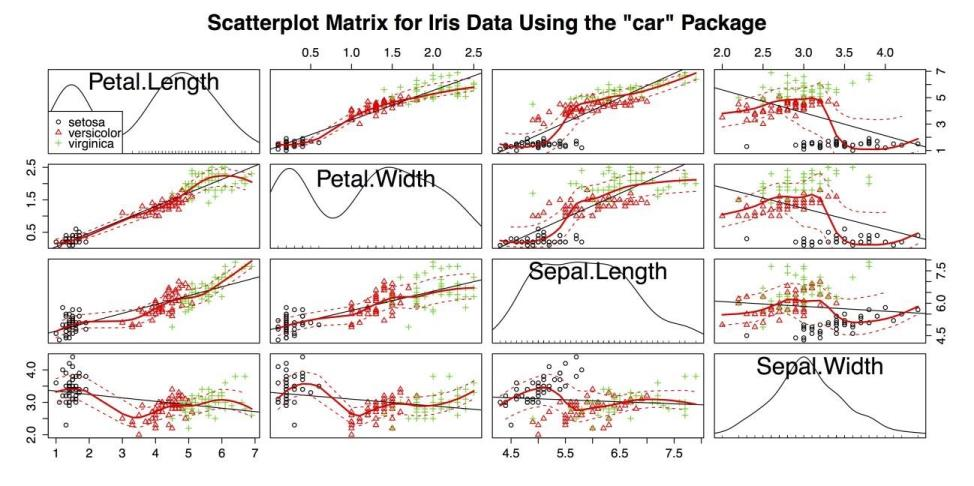

## Charts for Three or More Variables 

### The methods that are covered in the previous sections provided an initial approach to explore the associations between variables, but those methods are limited to two variables at a time. Outside of a basic laboratory experiment, however, there is often a need to look at several variables at once. The methods that you can discuss in this chapter allow you to visualize the connections between three or more variables at a time. 

### When an analysis addresses one variable at a time, it's called a univariate analysis. When an analysis addresses the associations between pairs of variables, it's called a bivariate analysis. When an analysis addresses multiple variables, then it is called as multivariate analysis. However, the term “multivariate” is typically reserved for situations where you specifically have more than one outcome variable. Those kinds of statistics are much more complicated than one predictor variable with a single outcome variable. With this in mind, the term “multivariate” is avoided for these procedures and instead multiple variables are used. 

## Clustered bar chart for means 

Bar chart of means when there is more than one predictor variable. In this situation, a clustered bar chart is the best choice. It is important to point out that many programs, such as Excel, PowerPoint, and similar programs, may offer to do three-dimensional charts with the bars laid out in a grid. Though there are situations where this is a reasonable solution, they are rare. Three-dimensional charts are nearly always harder to read accurately than flat charts. For this same reason, adding a false thickness to the bars should be avoided. It simply complicates the charts without adding any usable information. Consequently, a side-by-side chart is typically a better choice as it is easier to focus on the data and interpret it accurately. 

For this exercise, you can use the warpbreaks data from R’s datasets package. This data set gives the number of breaks in yarn in a loom according to the kind of yarn used (recorded as A and B) and the level of tension in the loom (recorded as L, M, and H, for low, medium, and high). 

The first step is to load the datasets package and the warpbreaks data. 

## Sample: sample_8_1.R 



# LOAD DATA 

require(“datasets”)  # Load datasets package 

data(warpbreaks)  # Load data into workspace



#### It is convenient when these data can work directly with R’s barplot() function, like this: barplot(breaks ~ wool*tension, data = warpbreaks). Unfortunately, that gives an error message saying “'height' must be a vector or a matrix,” that is, the variable containing the height for the bars that should be the mean number of breaks in this example must have a different format. You can get the data into the correct format by using a combination of the list() function that identifies the type of wool and the level of tension as factors (i.e., categorical predictor variables), and tapply() that applies a function FUN = mean, in this case to a ragged array, or an array that may contain empty cells. You can then save the restructured data into a new object called wbdata for “warpbreaks data”. 



# RESTRUCTURE DATA 

wbdata <- tapply(warpbreaks$breaks,  # Outcome 

                 list(warpbreaks$wool, warpbreaks$tension),  # Factors                  FUN = mean)  # Summary function

	

### You can then use wbdata to create the bar plot. 


# CREATE BARPLOT barplot(wbdata,  # Use a new summary table. 

        beside = TRUE,  # Bars side-by-side vs. stacked         col = c("steelblue3", "thistle3"),  # Colors 

        main = "Mean Number of Warp Breaks\nby Tension and Wool",         xlab = "Tension", 

        ylab = "Mean Number of Breaks") 
		
		

### Then you can add a legend using the interactive locator(1) function that lets you choose a location by clicking the mouse on the plot.  



# ADD LEGEND legend(locator(1),  # Use mouse to locate the legend.        rownames(wbdata),  # Use matrix row names (A & B)        fill = c("steelblue3", "thistle3"))  # Colors


### The resulting chart is shown in the following screenshot.

### You can complete by cleaning up the workspace. 


# CLEAN UP detach("package:datasets", unload = TRUE)  # Unloads the datasets package. 

rm(list = ls())  # Remove all objects from the workspace.


## Scatter plots by groups 

### The clustered bar chart for means that you looked at in the last section, is used when you have two categorical predictor variables and a single quantitative outcome. When, instead, you have one categorical and one quantitative predictor for the quantitative outcome, then a grouped scatter plot can work well. This is simply a scatter plot where the points are marked, usually by shape or color, according to the categorical variable. It is also possible to include separate fit lines such as linear regression lines or smoothers for each group. 

For this example, you can use the iris data from R’s datasets package.  

## Sample: sample_8_2.R 


# LOAD DATA require(“datasets”)  # Load the datasets package. 

data(iris)  # Load data into workspace. iris[1:3, ]  # Show the first three lines of data. 

  Sepal.Length Sepal.Width Petal.Length Petal.Width Species

1	5.1         3.5          1.4         0.2  setosa 

2	4.9         3.0          1.4         0.2  setosa 

3	4.7         3.2          1.3         0.2  setosa



### You can look at the relationship between sepal length and sepal width for the three different species in the iris data. 

### The easiest way to make a grouped scatter plot in R is with the external car package that you can use for the modified bivariate scatter plot in the section Charts for associations. 



# LOAD "CAR" PACKAGE 

require("car")  # "Companion to Applied Regression"



### You can use the scatterplot() function that can also be called with abbreviated name sp(). The important difference between this code and the command for the bivariate scatter plot is the addition of the pipe operator, that is used here to separate a grouping variable or factor  Species, in this case from the rest of the function. 



# SCATTERPLOT BY GROUPS sp(Sepal.Width ~ Sepal.Length | Species,  # Group by species. 

   data = iris,     xlab = "Sepal Width",     ylab = "Sepal Length",     main = "Iris Data",     labels = row.names(iris))  # Label names. 


### The resulting chart is shown in the following screenshot. 

### The car package uses both colors and shapes to indicate group membership. By default, it also superimposes a linear regression line and a lowess smoother for each group, matched by color. 

### You can finish by unloading the packages and clearing the workspace. 



# CLEAN UP detach("package:datasets", unload = TRUE)  # Unloads the datasets package. detach("package:car", unload = TRUE)  # Unloads the car package. rm(list = ls())  # 

Remove all objects from workspace.


## Scatter plot matrices 

### The grouped scatter plot you created in the last section is able to show the relationship between two quantitative variables while indicating group membership on a third, categorical variable. While that chart is impressively information-dense, it did not include all of the variables in the data set. To get all four quantitative variables in a chart, you need to do a scatter plot matrix that is simply a collection of bivariate scatter plots. There are a few different ways to do this: R’s default pairs() function, pairs() with a custom function, or the 

scatterplotMatrix() function from the car package. You can explore each approach, but first you need to load our data. Sample: sample_8_3.R 



require("datasets")  # Load the datasets package. 

data(iris)  # Load data into the workspace. iris[1:3, ]  # Show the first three lines of data. 

  Sepal.Length Sepal.Width Petal.Length Petal.Width Species 

1	5.1         3.5          1.4         0.2  setosa 

2	4.9         3.0          1.4         0.2  setosa 

3	4.7         3.2          1.3         0.2  setosa



### The first approach you can use is R’s pairs() function. The only argument needed for this function is the name of data frame. However, because the fifth variable in iris is categorical  the species name you can exclude it by using only the first four columns of data. 



# SCATTERPLOT MATRIX WITH DEFAULTS pairs(iris[1:4])  # Use just the first 

four variables from iris.



### The resulting plot is shown in the following screenshot.

### This is a reasonable plot, but it is not information-dense: there is no indication of group membership, there are no fit lines, and the large cells with the variable names can be used for other purposes.  

### You can fix these problems in few steps. The first step is to augment the names on the diagonal with histograms for each variable. You can create a custom function for this with the following code example that is adapted from the code in ?pairs in R’s built-in help. It creates a new function called panel.hist. This function is saved to the workspace and can be called when you run the pairs() function again. 


# FUNCTION TO PUT HISTOGRAMS ON DIAGONAL # Adapted from code in "pairs" help panel.hist <- function(x, ...) 

{   usr <- par("usr")  # Copies usr parameters for plot coordinates. 

  on.exit(par(usr))  # Restores parameters on exit. 

  par(usr = c(usr[1:2], 0, 1.5) )  # Sets plot coordinates.   h <- hist(x, plot = FALSE)  # Creates histogram.   breaks <- h$breaks  # Reads breaks for histograms.   nB <- length(breaks)  # Reads number of breaks.   y <- h$counts  # Get raw values for the y-axis.   y <- y/max(y)  # Adjusts raw values to fit the y scale.   rect(breaks[-nB], 0, breaks[-1], y,  ...)  # Draws boxes. } 

  
### To load the RColorBrewer package you can select a palette to indicate group membership in the plots. 


# SET COLOR PALETTE WITH RCOLORBREWER require("RColorBrewer")

  
### After creating the panel.hist function and loading the RColorBrewer package, you can run the pairs() function again with several options specified. The pairs() function has a wide array of options, allowing you to choose, for example that function is displayed in the diagonal, the upper panel, the lower panel, etc. (See ?pairs for more information.)  

### Also, the three species of iris are shown in different colors by calling the RColorBrewer palette Pastel1 in the col attribute and using the unclass() function to break the Species factor into a list of ones, twos, and threes. 



# SCATTERPLOT MATRIX WITH OPTIONS pairs(iris[1:4],  # Reads the 

data.       panel = panel.smooth,  # Adds an optional smoother.       

main = "Scatterplot Matrix for Iris Data Using pairs Function",      

 diag.panel = panel.hist,  # Calls histogram function.       pch = 

16,  # Uses solid dots for points.       # Next line color dots by "Species" category.       col = brewer.pal(3, 

"Pastel1")[unclass(iris$Species)])

  
### The resulting chart is shown in the following screenshot.

### The above screenshot is an improvement over scatter plot matrix with paris(), but it can still be improved. Most significantly, it is missing a legend to indicate group membership. It is also potentially troublesome to use a custom function with unknown compatibility issues. Instead, you can use the scatterplotMatrix() function from the car package. Also note in the following code example, the paste() function in the title attribute main. paste() puts separate strings together into a single string that makes it possible to write a long title in the R command but keep the code from being too wide. 


# SCATTERPLOT MATRIX WITH "CAR" PACKAGE require("car") 

scatterplotMatrix(~Petal.Length + Petal.Width +  

                   Sepal.Length + Sepal.Width | Species,                  

 data = iris, 

                  main = paste("Scatterplot Matrix for Iris Data", 

                               "Using the \"car\" Package"))

							   
  							   
### The previous command produces the following chart as shown.

### The above figure accomplishes several things at once: 

* It shows the relationship between four quantitative variables and one categorical variable. 
* It marks group membership with colors and shapes. 
* It provides a legend to the group variable. 
* It provides a linear regression line for each plot. 
* It provides a smoother with confidence intervals for each plot. 
* It provides kernel density estimators with rugplots for each variable. 

### These factors make the above figure the most information-dense chart you have created in the guidelines. This chart also serves as an example of the extraordinary flexibility and power of R, especially with the help of any of the thousands of external packages. 

### You can complete by returning the palette to the default, unloading the packages, and clearing our workspace. 



# CLEAN UP palette("default")  # Return to default. 

detach("package:datasets", unload = TRUE)  # Unloads the datasets package. 

detach("package:RColorBrewer", unload = TRUE)  # Unloads RColorBrewer detach("package:car", unload=TRUE)  # Unloads car package. 

rm(list = ls())  # Remove all objects from the workspace.

  	

