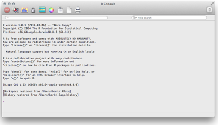
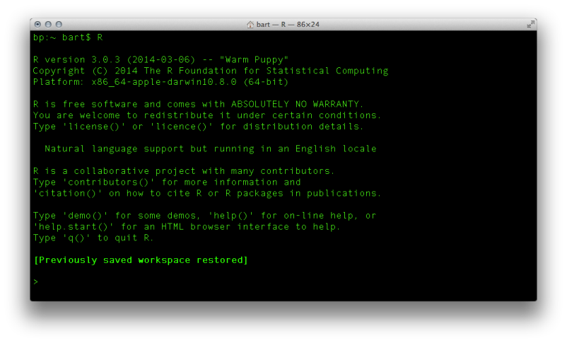
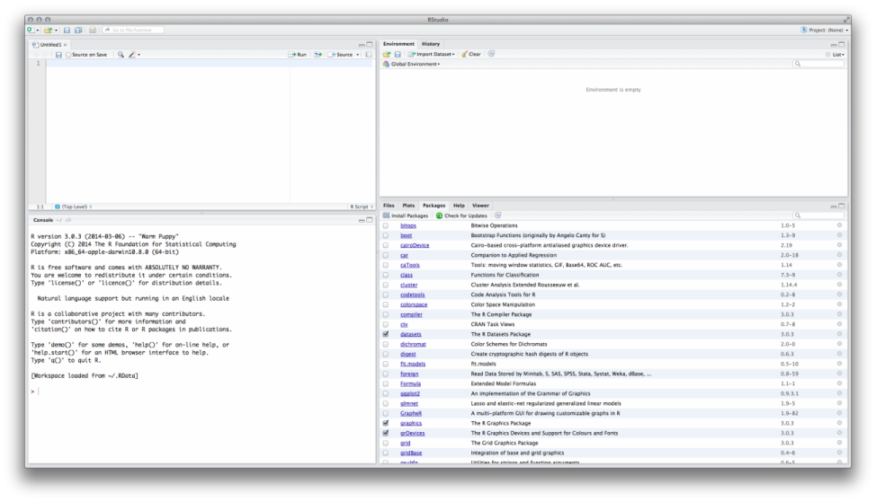
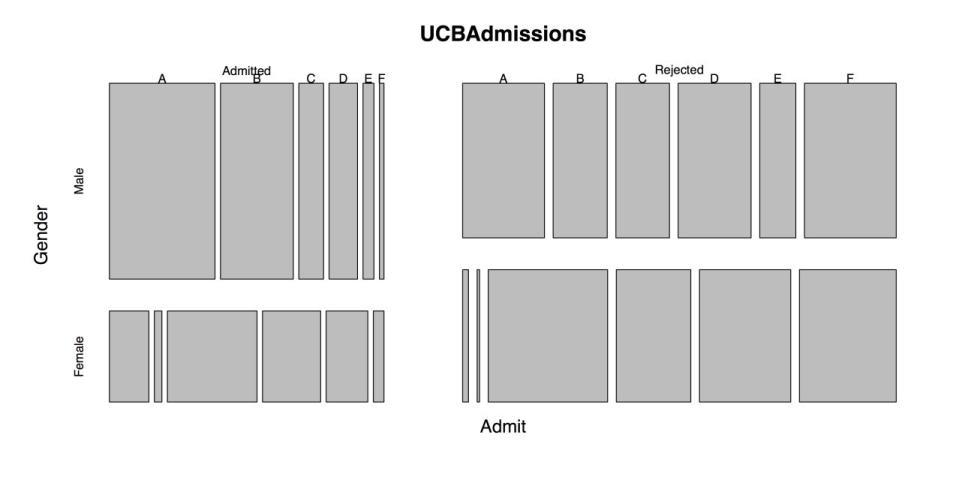
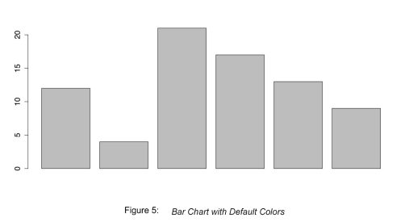
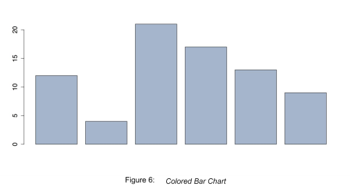
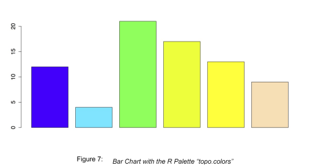
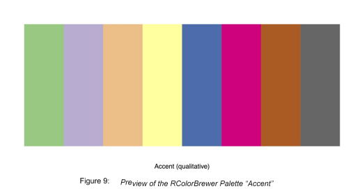
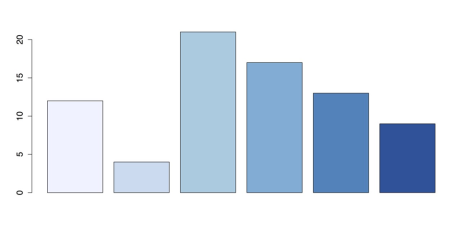

# Getting Started with R

R is a free, open-source statistical programming language. Its utility and popularity show the same explosive growth that characterizes the increasing availability and variety of data. And while the command-line interface of R can be intimidating at first, the strengths of this approach, such as increased ability to share and reproduce analyses, soon become apparent. The following guidelines serve as an introduction to R for those who are intrigued by its possibilities. Chapter 1 lays out the steps for installing R and a companion product, RStudio, for working with variables and data sets, and for discovering the power of the third-party packages that supplement R’s functionality.

## Installing R 

R is available for Windows, Mac, and Linux computers and can be downloaded for free. Installation is a simple process.

1. Open a web browser and go to  [R Project site](http://www.r-project.org/).
2. Under “Getting Started,” click “download R,” where you can choose a server from dozens of servers with downloads.
3. Though you can choose any of the servers, it is best to click the link [http://cran.rstudio.com/ ](http://cran.rstudio.com/)under “0-Cloud”.
4. Click the download link for your operating system; the top option is often the best.
5. Open the downloaded file and follow the instructions to install the software.

You should now have a functional copy of R on your computer. When you double-click the application icon and open it, you can see the default startup window in R. It looks something like the following figure.

For those who are comfortable working with the command-line, it is also possible to access R

that way. For example, opening Terminal on Mac and typing R at the prompt, gives the following figure.

You can see that the exact same boilerplate text that appeared in R’s IDE appears in the terminal.

Mostly, people run R in either of these two environments: R’s IDE, or the command-line. There are other methods that make working with R easier, and that is next.

## Installing RStudio 

R is a great way to work with data but the interface is not perfect. Part of the problem is that everything opens in separate windows. Another problem is that the default interface for R does not look and act the same way in each operating system. Several interfaces for R exist to solve these problems. Although there are many choices, the interface used here is RStudio.

Like R, RStudio is also available for Windows, Mac, and Linux computers and can be downloaded for free. Again, installation is a simple process, but note that you must first install R.

1. Open a web browser and go to [http://www.rstudio.com/](http://www.rstudio.com/)
2. Click “Download now”.
3. RStudio can run on desktop or over a Linux server. For the desktop version, click “Download RStudio Desktop”.
4. RStudio checks your operating system. Click the link under “Recommended for your system”.
5. Open the downloaded file and follow the instructions to install the software.

When you double-click the RStudio icon, you can see something like the following figure.

RStudio organizes the separate windows of R into a single panel. It also provides links to functions that can otherwise be difficult to find. RStudio has a few other advantages as well, such as:

* It allows you to divide your work into contexts or “projects.” Each project has its own working directory, workspace, history, and source documents.
* It has GitHub integration.
* It saves graphics history.
* It exports graphics in many sizes and formats.
* It can create interactive graphics via the Manipulate package.
* It provides code completion with the tab key.
* It has standardized keyboard shortcuts.

Studio is a convenient way of working with R, but there are other options. You may want to spend a little time looking at some of the alternatives so you can find what works best for you and your projects.RStudio is a convenient way of working with R, but there are other options. You may want to spend a little time looking at some of the alternatives so you can find what works best for you and your projects. 

## The R console 

When you open RStudio, the two windows you will work on the most are on the left, by default. The bottom window on the left is the R console, which has the R command prompt: > (the “greater than” sign). Two things can happen in the console. First, you can run commands here by typing at the prompt, although you cannot save your work there. Second, R gives the output for the commands.

You can try entering a basic command in the console to see how it works. For example, addition. Enter the following text at the command prompt and press Enter.



> 9 + 11 

	 

The first line contains the command you entered. In this case it is 9 + 11. Note that you do not need to type an equal sign or any other command terminator, such as a semicolon. Also, although it is not necessary to put spaces before and after the plus sign, it is good form.1 The output looks like this:



[1] 20 


The second line does not have a command prompt because it has the program’s output. The “1” in square brackets, [1], requires some explanation. R uses vectors to do math and that’s it how it returns the responses. The number in brackets is the index number for the first item in the vector on this line of output. Many other programs begin with an index number of 0, but R begins at 1. After the index number, R prints the output, the sum “20” in this case.

1 For more information on good form in R, see Google's style guide at  [http://google- ](http://google-styleguide.googlecode.com/svn/trunk/Rguide.xml)[styleguide.googlecode.com/svn/trunk/Rguide.xml.](http://google-styleguide.googlecode.com/svn/trunk/Rguide.xml)

The contents of the console scroll up as new information comes in. You can also clear the console by selecting Edit > Clear console or by pressing Ctrl+L (a lower-case L) on a Mac or PC. Note that this only clears the displayed data, it does not purge the data from the memory or lose the history of commands.

## The Script window 

The console is the default window in R, but it is not the best place to do your work. The major problem is that you cannot save your commands. Another problem is that you can enter only one command at a time. Given these problems, a much better way to work with R is to use the Script window. In RStudio, this is the window on the top left, above the console. In case you see nothing there, go to File > New File > R Script or press Shift+Command+N to create a new script document. 

A script in R is a plain text file with the extension “.R”. When you create a new script in R, you can save that script and you can select and run one or more lines of it at a time. You can recreate the simple addition problem we did in the console by creating a new script and then typing the command again. You can also enter more than one command in a script, even if you only run one at a time. To see how this works, you should type the following three lines. 



9 + 11 1:50 

print("Hello World") 



Note that there is no command prompt in the script window. Instead, there are just numbered lines of text. Next, save this script by either selecting File > Save or by pressing Command+S on Mac and Ctrl+S on Windows. 

When you want to run one command at a time, place your cursor anywhere on the line of desired command. Then select Code > Run Line(s) or press Command+Return on Mac or Ctrl+Return on Windows. This sends the selected command down to the console and display the results. For the first command, 9 + 11, this produces the same results that you had seen earlier when you entered the command at the console. 

The next two lines of code illustrate a few other, basic functions. The command 1:50 creates a list of numbers from 1 to 50. You can also see that the number in square brackets at the beginning of the line is the index number for the first item on that line. 



[1]  1  2  3  4  5  6  7  8  9 10 11 12 13 14 15 16 17 18 19 20 21 22 23 

[24] 24 25 26 27 28 29 30 31 32 33 34 35 36 37 38 39 40 41 42 43 44 45 46 [47] 47 48 49 50 



If you run the third line of text, print("Hello World!"), you get this output. 


[1] "Hello World!" 

The output "Hello World!" is a character vector of length 1. This is the same as a string in C or other languages. 

## Comments 

It is good form to add comments to your code. Comments can help you remember what each section of your code does. Comments also help make your code reproducible so that other people can follow your logic. This is critical in collaborative projects, as well as projects that you might revisit later. 

To make a comment in R, type # followed by your text. You can also “comment out” a line of code to disable it while you try alternative lines. To make a multiline comment, you need to comment each line, as R has no built-in multiline function. RStudio makes it easy to comment out lines. Just select the text and go to Code > Comment/Uncomment Lines or press Shift+Command+C on Mac or Shift+Ctrl+C on Windows. 



# These lines demonstrate commenting in R. 

# First, add an inline comment on a line of code to explain it. print("Hello World!")  # Prints "Hello World" in the console. 

# Second, comment out a variation on a line of code.  

# print("Hello R!")  # This line will not run while commented out.



## Data structures 

### R recognizes four basic structures of data: 

1. Vectors: A vector is a one-dimensional array. All of the data must be in the same format, such as numeric, character, and so on. This is the basic data object in R. 
2. Matrices and Arrays: A matrix is similar to a vector in that, all of the data must be of the same format. A matrix, however, has two dimensions; the data is arranged in rows and columns, where the columns must be of the same length, but the columns are not named. An array is similar to a matrix except that it can have more than two dimensions. 
3. Data frames: A data frame is a collection of vectors that are all the same length. The difference between a data frame and a matrix is that a data frame can have vectors of different data types, such as a numeric vector and a character vector. The vectors can also have names. A data frame is similar to a data sheet in SPSS or a worksheet in Excel (with the difference, again, that the vectors in a data frame must all be the same length). 
4. Lists: A list is the most general data structure in R. A list is an ordered collection of elements of any class, length, or structure (including other lists). Many statistical functions, however, cannot be applied to lists. 

### R also has several built-in functions for converting or coercing data from one structure to another.

* as.vector() can coerce matrices to one-dimensional vectors, although it may be necessary to first coerce them to matrices.
* as.matrix() can coerce data structures into the matrix structure.
* as.data.frame() can coerce data structure into data frames
*  as.list() can coerce data structures to lists 

## Variables 

### Variables are easy to create in R. Just type the name of the variable, there is no need to assign the variable type. Next, use the assignment operator, “<-“. You can read this as “gets," so that x <- 2 means "x gets 2." It is possible to use the equal sign for assigning values, but that is bad form in R. In the following two lines, a variable x is created, assigned the values 1 to 5, and then made to display the contents of x by typing its name. 



x	<- 1:5  # Put the numbers 1-5 in the variable x x  # 

Displays the values in x



### If When you want to specify each value that you assign to a variable, you can use the function c. This stands for "concatenate," although you can also think of it as "combine" or "collection." This function creates a single vector with the items you assign to it. As a note, RStudio has a convenient shortcut for the assignment operator, <-. When you are typing in your code, use the shortcut Alt+Hyphen and RStudio inserts a leading space, the assignment operator, and a trailing space. You can then continue with your coding. 

### Assigned here are the values 7, 12, 5, 4, and 9 to the vector y. 



x	<- c(7, 12, 5, 4, 9)



### The assignment operator can also go from left to right or it can include several variables at once. 



15 -> a  # Can go left to right, but is confusing. 

a <- b <- c <- 30  # Assign the same value to multiple variables.



### To remove a variable from R's workspace, use the rm function. 



rm(x)  # Remove the object x from the workspace. 

rm(a, b)  # Remove more than one object. rm(list = ls())  # 

Clear the entire workspace.



## Packages 

### The default installation of R is impressive in its functionality but it cannot do everything. One of the great strengths of R is that you can add packages. Packages are bundles of code that extend R's capabilities. In other languages, these bundles are libraries, but in R the library is the place that stores all the packages. Packages for R can come from two different places. 

### Some packages ship with R but are not active by default. You can see these in the Packages tab in RStudio. Other packages are available online at repositories. A list of available packages can be viewed [here](http://cran.r-project.org/web/views)[.](http://cran.r-project.org/web/views) This webpage is part of the Comprehensive R Archive Network (CRAN). It contains a list of topics or "task views" for packages. When you click on a topic, it takes you to an annotated list with links to individual packages. You can also search for packages by name [here](http://cran.r-project.org/web/packages/available_packages_by_name.html)[.](http://cran.r-project.org/web/packages/available_packages_by_name.html) Another good option is the website [CRANtastic](http://crantastic.org/)[.](http://crantastic.org/) All the packages at these sites are, like R, free and open source.  

### To see the packages that are currently installed or loaded, use the following functions: 



library()  # Brings up editor list of installed packages. search()   # 

Shows packages that are currently loaded.



### library() brings up a text list of functions. The same information is available in hyperlinked format under the Packages tab in RStudio. search() displays the names of the active packages in the console. These are the same packages that have checks in RStudio's Package tab. 

### To install new packages, you have several options in RStudio. First, you can use the menus under Tools > Install Packages. Second, you can click "Install Packages" at the top of the Packages tab. Third, you can use the function install.packages(). Just put the name of the desired package in quotes and remember that, like most programming languages, R is case sensitive. The last option is best when you want to save the command as part of a script. 



install.packages("ggplot2")  # Download and install the ggplot2 package.



### R. There are two ways to do this. The first is library(), often used for loading packages in scripts. The second is require(), often used for loading packages in functions. Usually require(), works in either setting and avoids confusion about the meaning of "library".



library("ggplot2")  # Makes package available; often used in scripts. require("ggplot2")  # Also makes package available; often used in functions.  



To learn more about a package, you can use R’s built-in Help functions. Many packages also have vignettes that are examples of the package's functions. You can access these with the following code: 


vignette(package = "grid")  # Brings up list of vignettes in editor window 

?vignette  # For help on vignettes in general 

browseVignettes(package = "grid")  # Open webpage with hyperlinks vignette()  # List of all vignettes for currently installed packages browseVignettes()  # HTML for all vignettes for currently installed packages  



### You should also check for package updates on a regular basis. There are three ways to do this. First, you can use the menus in RStudio: Tools > Check for Package Updates. Second, you can go the Package tab in RStudio and click "Check for Updates." Third, you can run this command: update.packages(). 

### When you finish working in R, you may want to unload or remove packages that you may not use again soon. By default, R unloads all packages when it quits. If you want to unload them before then, you have two options. First, you can go to the Packages tab in RStudio and uncheck the packages one by one. Second, you can use the detach() command, like this: detach("package:ggplot2", unload = TRUE).

### If you would like to delete a package, use remove.packages(), like this: remove.packages("psytabs"). This trashes the packages. If you want to use a deleted package again you need to download it and reinstall it. 

## R’s datasets package 

### The built-in package "datasets" makes it easy to experiment with R's procedures using real data. Although this package is part of R's base installation, you must load it. You can either select it in the Packages tab or enter library("datasets") or require("datasets"). You can see a list of the available data sets by typing data() or by going to the [R Datasets](http://stat.ethz.ch/R-manual/R-devel/library/datasets/html/00Index.html)[Package](http://stat.ethz.ch/R-manual/R-devel/library/datasets/html/00Index.html)list. 

### For more information on a particular data set, you can search R Help by typing “?” and the name of the dataset with no space: ?airmiles. You can also see the contents of the dataset by entering its name: airmiles. To see the structure of the dataset, use str(), like this: str(airmiles). This shows you what kind of data set it is, how many observations and variables it has, and the first few values. 

IWhen you are ready to work with the dataset, you can load it with data(), like this: data(airmiles). It appears in the Environment tab in the top right of RStudio. 

### ’s built-in datasets are a wonderful resource. You can use them to try out different functions and procedures without having to find or enter data. You can learn all about datasets here.

## Entering data manually 

### R is flexible in that it allows you to get data into the program in many different ways.  

### The simplest, but not always the fastest, is to enter the data right into R. When you only have a handful of values, then this method might make sense.  

### IWhen you want to create patterned data, you have two common choices. First, the colon operator “:” creates a set of sequential integer values. For example: 



0:10



### Gives this ascending list: 



[1]  0  1  2  3  4  5  6  7  8  9 10



### Or, by placing the larger number first, as shown here: 



55:48  


### Then R creates a descending list: 



[1] 55 54 53 52 51 50 49 48  



### , more flexible choice for patterned data is the sequence function seq(). YYou can choose the step size:



seq(30, 0, by = -3)

seq(



### This size yields the following: 



[1] 30 27 24 21 18 15 12  9  6  3  0



### Or you can choose the list length: 



seq(0, 5, length.out = 11)  



### That gives you: 



[1] 0.0 0.5 1.0 1.5 2.0 2.5 3.0 3.5 4.0 4.5 5.0  



### You can also feed any of these functions into a new variable. Just declare the variable name and put the assignment operator before the function, like this: 



x <- seq(50, 150, by = 5)



### In case you have real data that is not sequenced, you can enter them into R by two ways. First, you can use the concatenate function c() as mentioned earlier. For example: 



x <- c(5, 4, 1, 6, 7, 2, 2, 3, 2, 8)



### Second, you can enter the numbers in the console using the scan() function. After calling this function, go to the console and type one number at a time. Press return after each number. When you finish, press return twice to send the data to the variable. 

### It only makes sense to enter data into R when you have sequential data or toy data. For a dataset of any real size, it is almost always easier to import the data into R. 

## Importing data 

An enormous amount of data resides in spreadsheets. R makes it easy to import such data, with some important qualifications. Many people also have data in statistical programs such as SPSS or SAS. R is also able to read that data, but again with an important qualification. 

## Avoid native files from Excel or SPSS 

You must not try to import native Excel spreadsheets or SPSS files. While there are packages designed to do both of these, they are often difficult to use and they can introduce problems. The R website says this about importing Excel spreadsheets (emphasis added): 

The most common R data import/export question seems to be “how do I read an Excel spreadsheet” … The first piece of advice is to avoid doing so if possible! If you have access to Excel, export the data you want from Excel in tab-delimited or comma-separated form, and use read.delim or read.csv to import it into R … [An] Excel .xls file is not just a spreadsheet: such files can contain many sheets, and the sheets can contain formulae, macros and so on. Not all readers can read other than the first sheet, and may be confused by other contents of the file. 

Many of the same problems apply to SPSS files. The good news is that there is a simple solution for these problems. 

## Importing CSV files 

### The easiest way to import data into R is with a CSV file, or comma-separated values spreadsheet. Any spreadsheet program, including Excel, can save files in the CSV format. Statistical programs like SPSS can do this, too. Then, to read a CSV file, use the read.csv function. You need to specify the location of the file and whether it has a header row for variable names. For example, on your Mac, you can import a file named "rawdata.csv" from the desktop this way: 



csvdata <- read.csv("~/Desktop/rawdata.csv", header = TRUE)


### A similar process can read data in tab-delimited TXT files. The differences are these: First, use read.table instead of read.csv. Second, you may need to be explicit about the separator, such as a comma or a tab, by specifying that in the command. Third, if you have missing data values, be sure to specify an unambiguous separator for the cells. When your separators are tabs, use the command sep = \t, as in this example: 



txtdata <- read.table("~/Desktop/rawdata.txt", header = TRUE, sep = "\t



### R and its available packages offer a variety of ways to get data into the program. Though it is almost always easiest to put the data into a CSV file and import that. But regardless of how you get your data into R, now you are ready to begin exploring your data. 

## Converting tabular data to row data 

### One important question to ask right away is whether your data is in the right format for your analyses. This is most important for categorical data, because it is possible to collapse the data into frequency counts. An excellent example is the built-in R dataset UCBAdmissions. This dataset describes outcomes for graduate admissions at UC Berkeley in 1973. These data are important because they formed the basis of a major discrimination lawsuit. They are also a perfect example of Simpson's Paradox in statistics. Before you take a look at the code, you must know two things.  

### First, tabular data are data that can be organized into tables with rows and columns of frequencies. For example, you could create a table that showed the popularity of several Internet browsers. That table would have just one dimension or factor: which browser was installed. You could then add a second dimension that broke down the data by operating system. The browsers would be listed in the columns and the operating systems would be listed in the rows. This would be a two-way table, or cross-tabulation. The numbers in each cell of the table would give you the number of cases that matched that combination of categories, such as the number of Windows PCs running IE or the number of Android tablets running Chrome. It is, of course, possible to add more variables, that would usually be shown as separate panels or tables, each of which would have the same rows and columns. This is also the case in the UCBAdmissions data that is used in this example. The data are arranged in rows and columns, or simply panels, to get “marginal” totals, that are more often just called “marginals.” These marginals are the totals for one or more variables summed across other variables. So, for example, in your hypothetical table of browsers and operating systems, the marginal for browsers would be the total number of installations of each browser, ignoring the operating systems. In a similar manner, the marginals for the operating system give the total number of installations for each OS, ignoring the browser. The marginals are important because they are often of greater interest than the data at maximum dimensionality, that is., where all of the dimensions or factors are broken down to their most detailed level). 

### Second, I am going to use two plotting commands in this example—barplot() and plot()and the next on color that I have not yet presented. Right now I am using them to demonstrate other principles but I will explain them fully in the next chapter on graphics. 

### The code for this section is available in a single R file, sample_1_1.R, but I will break it into parts for readability. 

## Sample: sample_1_1.R 


# LOAD DATA 

require(“datasets”)  # Load datasets package 

?UCBAdmissions  # Data from graduate admissions at UC Berkeley in 1973. str(UCBAdmissions)  # Tabular data in 3 dimensions; N = 4526. 

UCBAdmissions  # Prints six tables; one for each department.





# TRY DEFAULT PLOTS admit.fail <- (UCBAdmissions$Admit)  # Doesn't work. barplot(UCBAdmissions$Admit)  # Doesn't work. plot(UCBAdmissions)  # Makes a plot, but not the one we wanted.



### This code produces the following figure, an unusual 3-way bar plot. When you want a simple bar chart of the number of people who applied to each of the six departments, this doesn't work. 

_Figure_ _4__: Default Plot of UCBAdmissions_

### The next step is to get the marginal frequencies from the 3-way table. At this point, the frequencies are just displayed in the console.



# SHOW MARGINAL FREQUENCIES margin.table(UCBAdmissions, 1)  # 

Admit margin.table(UCBAdmissions, 2)  # Gender

 margin.table(UCBAdmissions, 3)  # Dept margin.table(UCBAdmissions)     # Total



### Next save the marginal frequency for department, as this has the data you need for the chart. 



# SAVE MARGINALS 

admit.dept <- margin.table(UCBAdmissions, 3)  # Creates table for dept str(admit.dept)  # Describe the structure of the data table barplot(admit.dept)  # Makes a default barplot of the frequencies admit.dept  # Show frequencies 

prop.table(admit.dept)  # Show as proportions 

round(prop.table(admit.dept), 2)  # Show as proportions w/2 digits round(prop.table(admit.dept), 2) * 100  # Percentages w/o decimals



### However, further analyses need the data to be structured as one row per person. You can do that by converting from a table to a data frame to a list to a data frame.



# RESTRUCTURE DATA admit1 <- as.data.frame.table(UCBAdmissions)  # Coerces to data frame 

# This repeats each row by Freq admit2 <- lapply(admit1, function(x)rep(x, admit1$Freq))   admit3 <- as.data.frame(admit2)  # Converts from list back to data frame. admit4 <- admit3[, -4]  # Removes fifth column that has frequencies. 

# admit4 is the final data set, ready for analysis by case.



### It is also possible, though substitution, to do the entire conversion in one long command: 



# COMBINE ALL STEPS 

admit.rows <- as.data.frame(lapply(as.data.frame.table(UCBAdmissions), function(x)rep(x, as.data.frame.table(UCBAdmissions)$Freq)))[, -4]



### The commands above show one way to organize data into the structure that are most useful for analysis. In other situations different approaches will be more helpful, but this gives you a useful idea of what you can do in R. 

## Color 

### When you make graphs in R, you should consider your design decisions. Factors like layout and color can make or break visualizations. Consider a bar chart made with R’s default colors. 

## Sample: sample_1_2.R 



# LOAD DATA 

x = c(12, 4, 21, 17, 13, 9)  # Data for bar chart



### The following command uses the default colors.



# BARPLOT WITH DEFAULT COLORS barplot(x)  # 

Default barplot


### You can improve the above figure by changing the colors of the bars using the col attribute in the barplot function. R gives you several methods to specify colors. 

### R has names for 657 colors, arranged in alphabetical order, except for white, that is first on the list. You can see a text list of all the color names by entering colors(). You can also see a PDF with color charts [here](http://research.stowers-institute.org/efg/R/Color/Chart)[.](http://research.stowers-institute.org/efg/R/Color/Chart) If you want to change the bars to slategray3, you can do so in several ways: 

* Color name: slategray3. 
* Color location in list: slategray3 is index number 602 in the vector of colors. 
* RGB hex codes: According to this [Stowers Institute chart](http://research.stowers-institute.org/efg/R/Color/Chart/ColorChart.pdf)[,](http://research.stowers-institute.org/efg/R/Color/Chart/ColorChart.pdf) slategray3 is #9FB6CD 
* RGB color on a 0-255 scale: Use col2rgb("slategray3")  to get 159, 182, and 205 or see the values on the previous PDF. You must specify 255 as the maximum value. 
* RGB color on a 0-1 scale: Divide the previous values by 255 to get .62, .71, and .80. 

### You can then use these values in the col attribute: 



# METHODS TO SPECIFY COLORS 

barplot(x, col = "slategray3")  # Color by name. 

barplot(x, col = colors() [602])  # slategray3 is 602 in the list. barplot(x, col = "#9FB6CD ")  # RGB hex code. 

barplot(x, col = rgb(159, 182, 205, max = 255))  # RGB 0-255 barplot(x, col = rgb(.62, .71, .80))  # RGB 0.00-1.00



### Any of the previous commands produce the chart in the following figure.

### When you want the bars to be of different colors, then you can either specify the colors one at a time or you can use a color palette. To specify the individual colors, just use the concatenate function c() in the col attribute, like this: col = c("red", "blue"). You can use any of the color specification methods in the section. Then the colors cycle through for each of the bars. 

### A palette can give a wider range of colors, as well as colors that look better together. You can use R's built-in palettes by specifying the name of the palette and the number of colors you desire. Some of R’s palettes are: 

* rainbow: bright primary colors 
* heat.colors: yellow through red 
* terrain.colors: gray through green 
* topo.colors: purple through tan 
* cm.colors: blues and pinks 

### Run the command “?paletteb” for more information on R’s built-in palettes. 

### To use the topo.colors palette for the six bars, enter the following: 



# BARPLOT WITH BUILT-IN PALETTE barplot(x, col = topo.colors(6))



### The output of the previous code is shown in the following figure.

### An attractive alternative to R's palettes is the package RColorBrewer. This package derives from the excellent website [ColorBrewer 2.0](http://colorbrewer2.org/)[.](http://colorbrewer2.org/) RColorBrewer provides several palettes of sequential, diverging, and qualitative colors. To use RColorBrewer, you must first install it and load it in R: 



# INSTALL AND LOAD RCOLORBREWER PACKAGE install.packages("RColorBrewer") require("RColorBrewer")



### I encourage you to explore the help information for RColorBrewer by entering help(package = 

### "RColorBrewer"). You can see all the available palettes by entering display.brewer.all(). 

### This produces the following figure. The overlapping labels are due to the landscape aspect ratio.

### You can get a better view of an individual palette by specifying the palette and the number of colors desired, like this: display.brewer.pal(8, "Accent"). The following figure illustrates this palette. 

### To apply an RColorBrewer palette to a bar chart, call brewer.pal in the col attribute. Also specify the palette and the number of colors desired. 



# BARPLOT WITH RCOLORBREWER PALETTE 

barplot(x, col = brewer.pal(6, "Blues"))



### This command produces the following figure. 

### When you finish, it is a good idea to restore the default palette and clean up: 



# CLEAN UP palette("default")  # Return to default palette. 

detach("package:RColorBrewer", unload = TRUE)  # Unloads RColorBrewer rm(list = ls())  # Removes all objects from workspace.



