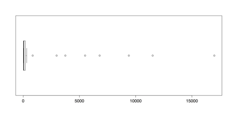
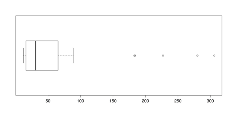
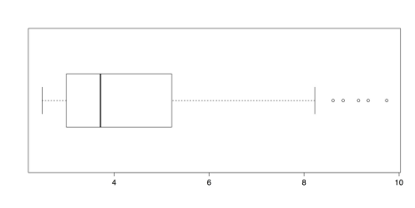

# Modifying Data 

All data can tell an attentive analyst something of worth. The problem is that the story you are able to get from the data may not be the story that you need. One method for getting results that are more closely aligned to your research questions can be to modify the data. Explained here are four kinds of modifications that can help you get more insights out of your data: compensating for outliers, transforming distributions, creating composite variables, and dealing with missing data. 

## Outliers 

Outliers can distort analyses so much that the results are either misleading or meaningless. There are several common methods for dealing with outliers: 

* Leave them in. If they are legitimate values and a necessary part of your equations, such as calculating the value of a stock portfolio, then they should remain. 
* Delete them. If your goal is to analyze common cases, then it may be acceptable to delete outliers. Be clear that you have done so and give your justification. 
* Transform the data. For example, with high outliers, it may help to use a logarithmic transformation. Again, be clear that you have done so and give your justification. 
* Use robust statistics. Measures such as the mean, the trimmed mean, or various robust estimators are less affected by outliers. These measures are, however, more difficult to implement and do not correspond to other common analyses such as regression or correlation. 

You can learn about the simplest of these adjustments: deleting outliers. You can use the islands dataset from the R datasets package. This dataset contains the areas of 48 landmasses that exceed 10,000 square miles. Several of these measurements are outliers. 

The easiest way to check for outliers is with a boxplot, using R’s boxplot() function, and then follow up with numerical descriptions from boxplot.stats(). 

### Sample: sample_4_1.R 


#LOAD DATA & INITIAL CHECKS require(“datasets”) 

data(islands)  # Areas (in 1k sq mi) of landmasses > 10k sq mi (n = 48) boxplot(islands, horizontal = TRUE)  # Many high outliers. boxplot.stats(islands)  # Numbers for the boxplot.


The following figure shows that there are numerous outliers in this dataset. In fact, the outliers comprise almost the entire range of measurements.

####The boxplot.stats() function gives the five values for the boxplot’s hinges, not including the outliers, as well as the sample size, the confidence intervals for the median, and the values for the outliers. In this dataset, the value for the upper fence is 306 and the closest outlier is 840. To delete the outliers, simply select all of the values beneath them. You can create a new dataset with those values and then check the new distribution with this code: 

# DELETE OUTLIERS 

islands.low <- islands[islands < 500]  # Delete 8 highest boxplot(islands.low, horizontal = TRUE) boxplot.stats(islands.low)


The following figure illustrates the new boxplot for the reduced dataset: 

####It may be surprising that there are five new outliers in this distribution. That is because about 16% of the previous distribution is deleted, adjusted the quartile values that are used in determining outliers. It is, of course, possible to repeat the process until there are no longer any outliers. Such an approach, though, if done without a sound theoretical justification, does damage to the analysis. Such ad hoc approaches should be avoided as a rule. 

Once you have saved your work, you can clear the workspace of unneeded variables, objects, or packages: 



# CLEAN UP detach("package:datasets", unload = TRUE)  # Unloads data sets package. rm(list = ls())  # Remove all objects from the workspace.


### Transformations 

####When confronted with outliers in the guidelines above, they were simply deleted. While this may be an expedient approach, it also loses data and may lead to distorted conclusions. Another way to deal with outliers is to transform the distribution. For example, in a distribution that has all positive scores and high outliers, a logarithmic transformation is often effective. This is the approach used for the islands data. If the data are still loaded from the previous exercise then you can go straight to the transformation. 

### Sample: sample_4_2.R # LOGARITHMIC TRANSFORMATION 

islands.ln <- log(islands)  # Compute natural log (base = e) boxplot(islands.ln, horizontal = TRUE)  # Almost looks normal.


The log() function calculates natural logs with base e, which is approximately 2.718. R also calculates common, base 10 logs with log10() and binary, base 2 logs with log2(), with similar results. Note that logarithms are undefined for zero. If you have zeros in your data, then you could add a small amount 0.5 or 1.0 to each score to avoid this problem. 

####

####The boxplot of transformed values in the above figure has only a few outliers. It is also much better suited for analysis than the distribution of raw scores in Figure 21 or even the trimmed distribution in Figure 22. 

####A logarithmic transformation is not linear because it affects outlying scores more than central scores. It is, however, an information-preserving or reversible transformation. That is, it is possible to undo the transformation, by raising the scores to the appropriate exponent, and accurately recreate the original data. The next two transformations, by contrast, lose information. Each has its place, though, and can be useful depending on the nature of the data and the analytical question. 

####The first of these information-losing transformations is ranking. The scores are placed an order and a rank of 1 is given to either the highest or lowest score. The order of scores is maintained but the distance between scores is lost. One important consideration is how to deal with tied scores. R gives choices of “average," "first," "random," "max," and "min". If random is used, then the histogram of scores is flat, as each score occurs only once. 


# RANK TRANSFORMATION 

islands.rank <- rank(islands, ties.method = "random")  # Ranks islands



####The last method of data transformation is dichotomization, or splitting scores into two categories, such as high and low. This transformation loses the most information of all but can be useful for strongly skewed distributions with justifiable or naturally occurring breaks. In the islands data, there is such a naturally occurring split: out of the eight outlying scores, seven are continents. It is reasonable to separate continents from islands and so a dichotomous split may be appropriate. All that is needed is a command that assigns a score of 0 to any case with a value below a certain cutoff and a score of 1 to any case that is above the cutoff. In this dataset, the largest island, Greenland, has an area of 804, that is, 804,000 square miles, while the smallest continent, Australia, has an area of 2968, or nearly three million square miles. As such, any value between those two could serve as a cutoff. In the code below, a score of 1000 serves as the cutoff. 

####As a note, while the dichotomization can be done with a pair of if statements or an if and else, it is slightly more concise to use an ifelse statement (see ?ifelse). This function takes three arguments:  

1. The test, islands > 1000 in this case.  
2. The value to return if the test result is positive, 1 in this case.  
3. The value to return if the test result is negative, 0 in this case.  

####The function then feeds into a new variable called continent, and assigns a 1 to all of the continents and a 0 to all of the islands. In this example, listed are all of the continents by using the command continent[continent == 1] , that says to print out all of the rows of continent where the value for continent is equal to 1. 

# DICHOTOMIZATION continent <- ifelse(islands > 1000, 1, 0)  # Creates the indicator variable. 

continent  # List islands and 0/1 for continent. 

continent[continent == 1]  # List just the continents. 

       Africa    Antarctica          Asia     Australia        Europe  

            1             1             1             1             1  

North America South America  

            1             1


####Each of these four transformations can be appropriate depending on your data and your research questions. The most important criterion when choosing a method is whether it is informative for your purposes, which is an important analytical judgment call. 

####Once you have saved your work, you can clear the workspace of unwanted variables, objects, or packages: 

# CLEAN UP detach("package:datasets", unload = TRUE)  # Unloads data sets package. rm(list = ls())  # Remove all objects from workspace.

### Composite variables 

####A common task in analytics is to create composite variables, or variables that are composed of other variables. Frequent examples include sums, averages, or weighted index scores. R has two built-in functions that make the first two of these tasks easy: rowSum() and rowMeans(). An unfortunate requirement of these functions, though, is that the entire data set must consist of numeric values and all of the variables must be included in order. This stands in contrast to programs like SPSS or even Excel, that allow you to pick and choose variables as well as the order in which they are entered. The solution to this problem is to create a sub-data frame that contains just the variables you need, as shown in the code that follows. You can begin by entering a small dataset with three numeric variables and one string variable. 

#### Sample: sample_4_3.R 

# ENTER DATA  data1 <- read.table(          header = TRUE, # First row is the header. 

         # No comments within the data.          text = ' 

         A  B  C   D 

         5  3  1  D1 

         2  4  6  D2 

         6  7  8  D3 

         ') data1  # check data



####The rowSum() and rowMeans() functions cannot include the string variable, so you can create a second dataset that does not include it: 

# CREATE DATA FRAME WITH NUMERIC VARIABLES ONLY data2 <- data1[, 1:3]  # Exclude the string variable. data2  # Check the data.

####It is also possible to skip intermediate variables by using the concatenate function, c(). For example, if there are seven variables and you want to include variables 1, 2, 3, 5, and 7, but with 7 first, you could write data[, c(7, 1:3, 5)]. 

####Once you have this reduced, numeric-variables-only data set, you can run the rowSum() and rowMeans() functions. Here is the first: 

# AVERAGE ACROSS BOTH VARIABLES 

# ROW SUMS rowSums(data2) [1]  9 12 21


And here is the second: 

# ROW MEANS rowMeans(data2) 

[1] 3 4 7



####Other arithmetic functions are possible if they are performed before creating the secondary data frame. Once you have saved your work, you can clear the workspace of unneeded variables and objects: 

# CLEAN UP rm(list = ls())  # Remove all objects from workspace.

### Missing data 

####Missing data can present a substantial challenge for analysis. In R, missing data are typically coded as NA, for “not available.” Certain functions in R are able to accommodate missing data but others are not. For this reason, it is helpful to know how to deal with missing data. There are generally two approaches: remove or ignore the missing data, or replace the missing values with valid values through imputation. 

### Sample: sample_4_4.R 

# DATA WITH NA 

x1 <- c(1, 2, 3, NA, 5)  # Sample data with NA 

summary(x1)  # "summary" still works with NA 

   Min. 1st Qu.  Median    Mean 3rd Qu.    Max.    NA's     1.00    1.75    2.50    2.75    3.50    5.00       1 mean(x1)  # But "mean" doesn't [1] NA



####In the previous example, R’s summary() function is able to work with missing data, but the closely related function mean() is not. If any values are NA for mean(), then the returned value is also NA. 

####In a large dataset, it may not be obvious which cases are missing data. A combination of R functions, which() and is.na(), can give the index number for any NA values in the specified variable. 



# FIND NA 

which(is.na(x1))  # Gives index number of NA [1] 4



####It is possible to tell R to ignore NA values in certain functions, such as mean(), by including na.rm = TRUE.



# REMOVE NA 

mean(x1, na.rm = TRUE)  # Removes NA from calculations 	 [1] 2.75



####In other situations, especially multivariate analyses, it may be more helpful to replace missing values with other, valid values. This can be done with is.na() and a value to be assigned in the place of missing values, such as 0.

# REPLACE NA 1: IS.NA 

x2 <- x1  # Copies data to new object 

x2[is.na(x2)] <- 0  # If item in x2 is NA, replace with 0 x2  # Show revised data [1] 1 2 3 0 5


####A better approach to replacing missing values is to use the mean or some other value. This approach, known as imputation, can be implemented with the previous code by replacing the 0 in x2[is.na(x2)] <- 0 with mean(x2, na.rm = TRUE). This requires that the original variable be copied first. It is also possible to create a new variable and impute the mean with a single ifelse() command: 

# REPLACE NA 2: IFELSE 

x3 <- ifelse(is.na(x1), mean(x1, na.rm = TRUE), x1)  # Impute mean x3  # Show revised data 

[1] 1.00 2.00 3.00 2.75 5.00



####These are a few very basic approaches to dealing with missing data. The treatment of missing data is an active area of research and many packages have been developed for this in R. Because these packages are updated or released frequently, you can look at R’s official [CRAN website](http://cran.r-project.org/web/packages/available_packages_by_name.html)or the third-party [CRANtastic](http://crantastic.org/)[.](http://crantastic.org/)

####And finally, once you have saved your work, you should clear the workspace of unneeded variables and objects with rm(list = ls()). 

