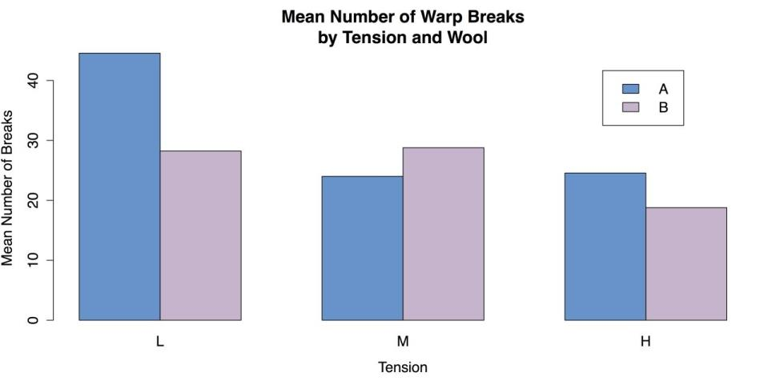
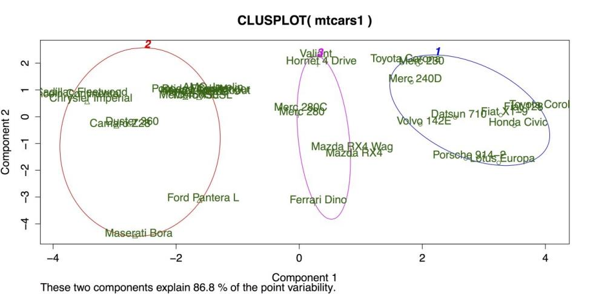
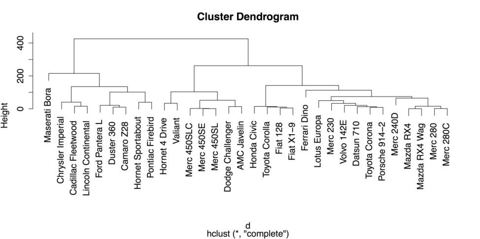
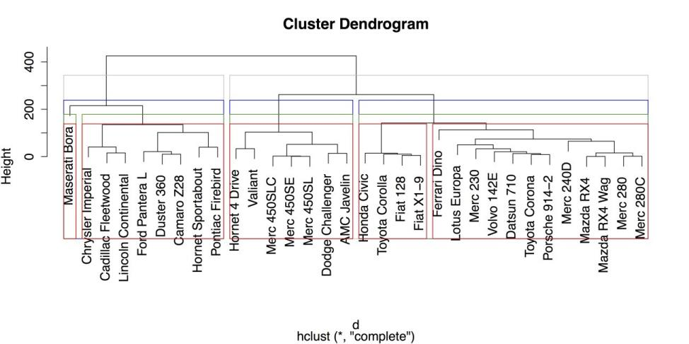
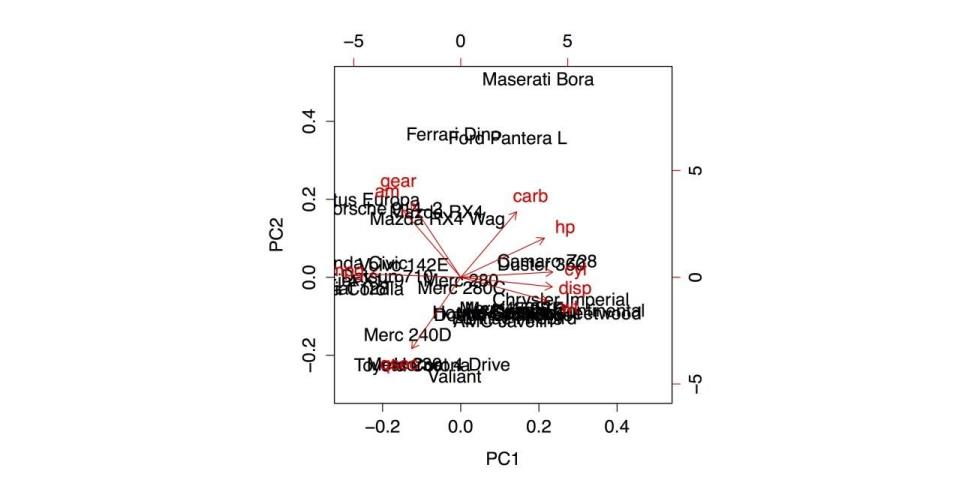

# Sample: sample_9_2.R 



# LOAD DATA require("datasets")  # Load the datasets package. 

data(warpbreaks)



There are two different ways to specify a two-factor ANOVA in R, but both use the aov() function. In the first method, the main effects and interaction are explicitly specified, as shown in the following code example. The results of that analysis can be viewed with the summary() function that you have used elsewhere. 



# ANOVA: METHOD 1 

aov1 <- aov(breaks ~ wool + tension + wool:tension,              data = warpbreaks) summary(aov1)  # ANOVA table 

             Df Sum Sq Mean Sq F value   Pr(>F)     wool          1    451   450.7   3.765 0.058213 .   tension       2   2034  1017.1   8.498 0.000693 *** wool:tension  2   1003   501.4   4.189 0.021044 *   Residuals    48   5745   119.7                      

--- 

Signif. codes:  0 ‘***’ 0.001 ‘**’ 0.01 ‘*’ 0.05 ‘.’ 0.1 ‘ ’ 1 



These results show a strong main effect of level of tension on the breakage of wool, with a smaller interaction with the kind of wool used. These results make sense, given the pattern of means you saw in the grouped bar chart back in section Statistics for Three or More Variables. Figure Grouped Bar plot for Means is reproduced as follows for your convenience: 

Grouped Bar Chart of Mean
{:.caption}

A second method for specifying the ANOVA spells out only the interaction and leaves the main effects as implicit, with the same results as the first method. 



# ANOVA: METHOD 2 

aov2 <- aov(breaks ~ wool*tension,              data = warpbreaks)



R is also able to provide a substantial amount of additional information via the model.tables() function. For example, the command model.tables(aov1, type = "means") gives tables of all the marginal and cell means, while the command model.tables(aov1, type = "effects") reinterprets those means as coefficients. 

Finally, when one or both of the factors has more than two levels, it may be necessary to do a post hoc test. As with the one-factor ANOVA discussed in the section Statistics for Associations, a good choice is Tukey’s HSD (Honestly Significant Difference) test, with the R command TukeyHSD(). 

You can complete this section by unloading and packages and clearing the workspace. 



# CLEAN UP detach("package:datasets", unload = TRUE)  # Unloads the datasets package. rm(list = ls())  # Remove all objects from workspace.



## Cluster analysis 

Cluster analysis performs a fundamental task: determining which cases are similar. This task makes it possible to place cases such as people, companies, and regions of the country, etc. into relatively homogeneous groups while distinguishing them from other groups. R has built-in functions that approach the formation of clusters in two ways. The first approach is k-means clustering with the kmeans() function. This approach requires the researcher to specify how many clusters like to form, although it is possible to try several variations. The second approach is hierarchical clustering with the hclust() function, in which each case starts by itself and then the cases are gradually joined together according to their similarity. You can learn these two procedures in turn. 

For these examples you can use a slightly reduced version of the mtcars data from R’s datasets package, where you remove two undefined variables from the data set. 

### Sample: sample_9_3.R 

# LOAD DATA require("datasets")  # Load the datasets package. mtcars1 <- mtcars[, c(1:4, 6:7, 9:11)]  # New object, select variables. mtcars1[1:3, ]  # Show the first three lines of the new object. 

               mpg cyl disp  hp    wt  qsec am gear carb Mazda RX4     21.0   6  160 110 2.620 16.46  1    4    4 

Mazda RX4 Wag 21.0   6  160 110 2.875 17.02  1    4    4 

Datsun 710    22.8   4  108  93 2.320 18.61  1    4    1 


In order to use the kmeans() function, you can specify the number of clusters you want. For this example, you can try three clusters, although further inspection might suggest fewer or more clusters. This function produces a substantial amount of output that can be displayed by calling the name of the object with the results that can be km in this case. 

# CLUSTER ANALYSIS: K-MEANS 

km <- kmeans(mtcars1, 3)  # Specify 3 clusters


Instead of the statistical output for the kmeans() function, it is more useful at this point to create a graph of the clusters. Unfortunately, the kmeans() function does not do this by default. You can instead use the clusplot() function from the cluster package. 

# USE "CLUSTER" PACKAGE FOR K-MEANS GRAPH require("cluster") 

clusplot(mtcars1,        # Data frame          km$cluster,     # Cluster data          color = TRUE,   # Use color          shade = FALSE,  # Colored lines in clusters (FALSE is default).          lines = 3,      # Turns off lines connecting centroids.          labels = 2)     # Labels clusters and cases.


This command produces the following chart. 

Cluster Plot for K-Means Clustering
{:.caption}

The above figure shows three clusters bounded by colored circles and arranged on a grid defined by the two largest cluster components. There is good separation between the clusters, but the large separation in cluster 2 on the far left suggests that more than three clusters may be appropriate. Hierarchical clustering can be a good method for checking on the number and size of clusters. 

In R, hierarchical clustering is done with the hclust() function. However, this function does not run on the raw data frame. Instead, it needs a distance or dissimilarity matrix that can be created with the dist() function. Once the dist() and hclust() functions are ran, it is then possible to display a dendrogram of the clusters using R’s generic plot() command on the model generated by hclust(). 

# HIERARCHICAL CLUSTERING d <- dist(mtcars1)  # Calculate the distance matrix. c <- hclust(d)  # Use distance matrix for clustering. plot(c)  # Plot a dendrogram of clusters.


The following screenshot shows the default dendrogram produced by plot(). In this plot, each case is listed individually at the bottom. The lines above join each case to other similar cases, while cases that are more similar are joined lower down such as the Mercedes-Benz 280 and 280C on the far right and cases that are more different are joined higher up. For example, it is clear from this diagram that the Maserati Bora on the far left is substantially different from every other car in the data set. 

Hierarchical Clustering Dendrogram with Defaults
{:.caption}

Once the hierarchical model is calculated, it is also possible to place the observations into groups using cutree() that represents a cut tree diagram, another name for  dendrogram. You must, however, tell the function how or where to cut the tree into groups. You can specify either the number of groups using k = 3, or you can specify the vertical height on the dendrogram, h = 230 that can produce the same result. For example, the following command categorizes the cases into three groups and then show the group IDs for the last three cases: 



# PLACE OBSERVATIONS IN GROUPS 

g3 <- cutree(c, k = 3)  # "g3" = "groups: 3" g3[30:32]  # Show groups for the last three cases. 

Ferrari Dino Maserati Bora    Volvo 142E  

            1             3             1



As a note, it is also possible to do several groupings at once by specifying a range of groups (k 

= 2:5 can do groups of 2, 3, 4, and 5) or specific values (k = c(2, 4) can do groups of 2 and 4). 

A final convenient feature of R’s hierarchical clustering function is the ability to draw boxes around groups in the dendrogram using rect.hclust(). The following code example superimposes four sets of different colored boxes on the dendrogram: 



# DRAW BORDERS AROUND CLUSTERS rect.hclust(c, k = 2, border = "gray") rect.hclust(c, k = 3, border = "blue") rect.hclust(c, k = 4, border = "green4") rect.hclust(c, k = 5, border = "red")


The result is shown in the following screenshot.

Hierarchical Clustering Dendrogram with Boxes around Groups
{:.caption}

From the above figure, it is clear that large, American cars form groups that are distinct from smaller, imported cars. It is also clear, again, that the Maserati Bora is distinct from the group, as it is placed in its own category once you request at least four groups. 

Once you have saved your work, you should clean the workspace by removing any variables or objects you created. 

# CLEAN UP detach("package:datasets", unload = TRUE)  # Unloads datasets package. detach("package:cluster", unload = TRUE)  # Unloads datasets package. rm(list = ls())  # Remove all objects from the workspace.


## Principal components and factor analysis 

The final pair of statistical procedures that you can learn in this section is principal components analysis (PCA) and factor analysis (FA). These procedures are very closely related and are commonly used to explore relationships between variables with the intent of combining variables into groups. In that sense, these procedures are the complement of cluster analysis that you have seen in the last section. However, where cluster analysis groups cases, PCA and FA group variables. PCA and FA are terms that are often used interchangeably, even when that is not technically correct. One explanation of the differences between the two is given in the documentation for the psych package: “The primary empirical difference between a components model versus a factor model is the treatment of the variances for each item. Philosophically, components are weighted composites of observed variables while in the factor model, variables are weighted composites of the factors.” In the experience, that can be a distinction without a difference. There is a very pragmatic approach to PCA and FA: the ability to interpret and apply the results are the most important outcome. Therefore, it sometimes helps to see the results of these analyses more as recommendations on how the variables can be grouped rather than as statistical dogma that is followed. 

With that caveat in mind, you can look at a simple example of how to run PCA and then FA in R. For this example, you can use the same mtcars data from R’s datasets package that you used in the last section to illustrate cluster analysis. You can exclude two variables from the data set because R does not provide explanations of their meaning. That leaves you with nine variables to work with. 

### Sample: sample_9_4.R 

# LOAD DATA require("datasets")  # Load the datasets package. mtcars1 <- mtcars[, c(1:4, 6:7, 9:11)]  # Select the variables. mtcars1[1:3, ]  # Show the first three cases. 

               mpg cyl disp  hp    wt  qsec am gear carb Mazda RX4     21.0   6  160 

110 2.620 16.46  1    4    4 

Mazda RX4 Wag 21.0   6  160  110  2.875  17.02  1    4    4 

Datsun 710         22.8   4  108  93   2.320  18.61  1    4    1


The default method for principal components analysis in R is prcomp(). This function is easiest to use when the entire data frame can be used. Also, there are two additional arguments that can standardize the variables and make the results more interpretable: center = TRUE that centers the variables’ means to zero, and scale = TRUE that sets their variance to one (i.e., unit variance). These two arguments essentially turn all of the observations into z-scores and ensure that the data have a form of homogeneity of variance that helps to stabilize the results of principal components analysis See ?prcomp for more information on this function and the center and scale arguments. 

# PRINCIPAL COMPONENTS pc <- prcomp(mtcars1,              center = TRUE,  # Centers means to 0 (optional).              scale = TRUE)  # Sets unit variance (helpful).


By saving the analysis in an object pc in this case you can call additional functions for several functions. The first is summary() that gives the proportion of total variance accounted for by each component. The first line, standard deviation, contains the square roots of the eigenvalues of the covariance/correlation matrix. 

# OUTPUT 

summary(pc)  # Summary statistics Importance of components: 

                          PC1    PC2     PC3     PC4     PC5     PC6     PC7 

Standard deviation     2.3391 1.5299 0.71836 0.46491 0.38903 0.35099 0.31714 

Proportion of Variance 0.6079 0.2601 0.05734 0.02402 0.01682 0.01369 0.01118 

Cumulative Proportion  0.6079 0.8680 0.92537 0.94939 0.96620 0.97989 0.99107 

                           PC8    PC9 

Standard deviation     0.24070 0.1499 

Proportion of Variance 0.00644 0.0025 

Cumulative Proportion  0.99750 1.0000 


Some plots are also available for PCA. The generic plot() function, when applied to the output of prcomp(),gives an unlabeled bar chart of the eigenvalues for each component, although that can be used to give an intuitive test of how many components should be retained.  

The function biplot() gives two dimensional plot with: 

1. The two largest components on the X and Y axes, respectively. 
2. Vectors to indicate the relationship of each variable in the data frame to those components. 
3. The labels for the individual cases to show where they fall on the two components.  

With your data, biplot(pc) gives the following output.

Biplot of the Principal Components Analysis
{:.caption}

The simplest use of factor analysis (FA) within R is to determine how many factors are needed to adequately represent the variability within the data. For example, in your data, you can run several iterations of the function factanal(), where you specify different numbers of possible factors and check the probability values on the resulting chi-squared test. In this case, you are looking for a model that is not statistically significant (i.e., _p_ > .05 as opposed to _p_ < .05) because you want a model that corresponds well with the data and does not deviate substantially from it. In each of the following four analyses, different number of factors are specified and the p-value from the last line of the printout is mentioned. The complete printout for the final command is also included. 



# FACTOR ANALYSIS 

factanal(mtcars1, 1)  # 1 factor, p < .05 (poor fit) factanal(mtcars1, 2)  # 2 factors, p < .05 (poor fit) factanal(mtcars1, 3)  # 3 factors, p < .05 (poor fit) factanal(mtcars1, 4)  # 4 factors, First w/p > .05 (good fit) Call: 

factanal(x = mtcars1, factors = 4) 

Uniquenesses: 

  mpg   cyl  disp    hp    wt  qsec    am  gear  carb  

0.137 0.045 0.005 0.108 0.038 0.101 0.189 0.126 0.031  

Loadings: 

     Factor1 Factor2 Factor3 Factor4 mpg   

0.636  -0.445  -0.453  -0.234  cyl  -0.601   

0.701   0.277   0.163  disp -0.637   0.555   

0.176   0.500  hp   -0.249   0.721   0.472   

0.296  wt   -0.730   0.219   0.417   0.456  

qsec -0.182  -0.897  -0.246          am    

0.891                  -0.100  gear  0.907           

0.226          carb          0.478   0.851          

               Factor1 Factor2 Factor3 Factor4 

SS loadings      3.424   2.603   1.549   0.644 

Proportion Var   0.380   0.289   0.172   0.072 

Cumulative Var   0.380   0.670   0.842   0.913 

Test of the hypothesis that 4 factors are sufficient. 

The chi square statistic is 6.06 on 6 degrees of freedom. 

The p-value is 0.416



These results suggest from the pattern of factor loadings that the first factor has to do with physical size of a car (with smaller cars getting higher factor scores), the second factor has to do with power and speed (with higher scores for more powerful and quicker cars), the third factor has to do with carburetor barrels (that reduces to the Maserati Bora factor, as it is the only car with eight carburetor barrels), and the fourth factor gives some additional variance to heavier cars with larger engines. These results are compared with the biplot that came from the PCA and the cluster analysis in the previous section to provide more complete understanding of the relationships between cases and variables in this data set. 

Once you have saved your work, you should clean the workspace by removing any variables or objects you created. 



# CLEAN UP detach("package:datasets", unload = TRUE)  # Unloads the datasets package. rm(list = ls())  # Remove all objects from the workspace.



