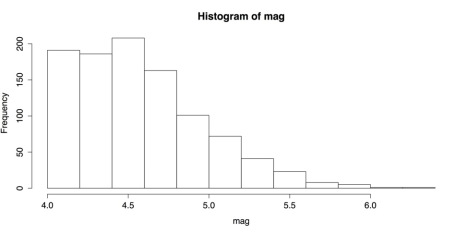

#  Statistics for One Variable 

The best beginning step for analyses is examining graphs for one variable. The following guidelines are the follow-up to graphical analysis: statistical procedures for one variable. 

## Frequencies 

The most common statistics for categorical variables are frequencies and proportions. First create a dataset based on a recent Google search. 

### Sample: sample_3_1.R 



# ENTER DATA 

# Hits in millions for each word on Google groups <- c(rep("blue", 3990),            
 rep("red", 4140),             rep("orange", 1890),             rep("green", 3770),   
 rep("purple", 855))



The rep() function repeats an item for a specified number of times. In the above code, for example, it repeats the word “blue” 3990 times. When the five color words are put together in the object groups, there are 14,645 lines of data. Although it may be easier to work with the data in tabular form, it is preferred to also have a dataset with one row per case. 

This next command creates a data table: 



# CREATE FREQUENCY TABLES 

groups.t1 <- table(groups)  # Creates frequency table  groups.t1  # Print table 

  blue  green orange purple    red    3990   3770   1890    855   4140 



The data are now in alphabetical order. There may be times when this is helpful, but for now it makes more sense to order them by frequencies. 



# MODIFY FREQUENCY TABLES 

groups.t2 <- sort(groups.t1, decreasing = TRUE)  # Sorts by frequency groups.t2  # Prints table groups 

   red   blue  green orange purple    4140   3990   3770   1890    855 



You may also want to present the data as proportions or percentages instead of frequencies. The function prop.table() does this:



# PROPORTIONS AND PERCENTAGES prop.table(groups.t2)  # Gives proportions of the total. 

      red      blue     green    orange    purple  

0.2826903 0.2724479 0.2574257 0.1290543 0.0583817



There are too many decimal places in this table. You can fix this with the round() function. Place the prop.table() function inside it and specify the number of decimal places you want:



round(prop.table(groups.t2), 2)  # Round to 2 decimal places. 

   red   blue  green orange purple    0.28   0.27   0.26   0.13   0.06 



That’s an improvement but we can take it further. The leading zeroes and decimals are repetitive. We can remove them by multiplying the results by 100: 



round(prop.table(groups.t2), 2) * 100  # Percents without decimals. 

   red   blue  green orange purple      28     27     26     13      6 
   


Once you have saved your work, you should clear the workspace of unneeded variables and objects with rm(list = ls()). 

## Descriptive statistics 

For categorical variables, there is a limited number of useful descriptive statistics. For quantitative variables, however, there is a much broader range of choices. In this section, we will use both R’s built-in functions and functions from external packages. Together, they give a rich statistical picture of our data. 

We will use R’s data set cars, which gives the speed of cars in MPH and the distances taken to stop in feet. The data were recorded in the 1920s, so there are some unusual values, such as a car taking 120 feet to stop from 24 MPH. (See ?cars for more information.) 

### Sample: sample_3_2.R 



# LOAD DATA SET 

require(“datasets”)  # Load the data sets package cars  # Print the cars data to the console data(cars) 
 # Load the data into the workspace



The easiest way to get descriptive statistics in R is with the summary() function. For quantitative variables, this function gives the five quartile values: minimum, first quartile, median, third quartile, and maximum, as well as the mean. It can also give some categorical statistics. 

To get statistics for a single variable, enter the variable's name: 



summary(cars$speed)  # Summary for one variable  

   Min. 1st Qu.  Median    Mean 3rd Qu.    Max.  

    4.0    12.0    15.0    15.4    19.0    25.0  



You can also do an entire data set at once: 



summary(cars)  # Summary for entire table (inc. categories)      speed          
 dist         Min.   : 4.0   Min.   :  2.00   

 1st Qu.:12.0   1st Qu.: 26.00   

 Median :15.0   Median : 36.00   

 Mean   :15.4   Mean   : 42.98   

 3rd Qu.:19.0   3rd Qu.: 56.00   

 Max.   :25.0   Max.   :120.00



Another option for descriptive statistics is the describe function in the psych package. This provides the following: 

* n 
* mean 
* standard deviation 
* median 
* trimmed mean (10% by default) 
* median absolute deviation from median (MAD) 
* minimum 
* maximum 
* range 
* skewness 
* kurtosis 
* standard error 

To use the describe function, you must first install and load the psych package, then call the describe() function: 



# ALTERNATIVE DESCRIPTIVES require("psych") 
describe(cars)  

      var  n  mean    sd median trimmed   mad speed   1 50 15.40  5.29     15   15.47  
	  5.93 dist    2 50 42.98 25.77     36   40.88 23.72         min  max range  skew 
	  kurtosis   se speed     4   25    21 -0.11    -0.67 0.75 dist      2  120   118
	  0.76     0.12 3.64



For more information on this package, enter help(package = "psych"). For help on the describe() function, enter ?describe. 

Once you have saved your work, you should clear the workspace of unwanted variables, objects, or packages.



# CLEAN UP detach("package:datasets", unload = TRUE)  # Unloads data sets package. 

detach("package:psych", unload=TRUE)  # Unloads psych package. rm(list = ls())  # Remove all objects from workspace.



##  Single Proportion: Hypothesis Test and Confidence Interval 

The simplest inferential procedures are for single proportions. These are dichotomous outcomes: pass or fail, yes or no, left or right, etc. The only data needed for these procedures is the number of trials “n”, and the number of positive outcomes “X”. For example, when a person flips a coin 40 times and gets 27 heads, then n = 40 and X = 27. R's prop.test() function is able to do both a null hypothesis test and a confidence interval for these proportions. Used here is the coin flip data for this example, first with the default settings and then with some options. 

### Sample: sample_3_3.R 



# PROPORTIONS TEST WITH DEFAULTS prop.test(27, 40)  # 27 heads in 40 coin flips. 

 	1-sample proportions test with continuity correction data:  27 out of 40, null probability 0.5 X-squared = 4.225, df = 1, p-value = 0.03983 alternative hypothesis: true p is not equal to 0.5 95 percent confidence interval: 

 0.5075690 0.8092551 sample estimates: 

    p  0.675
	


In these results, R repeats the data, 27 positive outcomes out of 40 trials, and gives the default null probability of 0.5. “X-squared” is ϰ2, the chi-squared value of 4.225. With one degree of freedom, the observed results have a probability value of 0.03983. Because this value is less than the standard .05, reject the null hypothesis; that is, it is concluded that 27 out of 40 heads is statistically significantly greater than 50%. R then states the alternative hypothesis that the true p, or the probability of a positive outcome, is not equal to 0.5. Next is the 95% confidence interval for the proportion, which ranges from 0.51 to 0.81. The output finishes with the observed sample proportion of 0.675, or 67.5%. 

R also provides several options for the one-sample proportions test. These options include:  

* The choice of a null proportion other than 0.5. non-directional, two-sided hypothesis test or a directional, one-sided test. In the latter case, you must specify whether you hypothesize that the sample proportion is greater than or less than the population value. 
* The choice of a confidence level other than the default of 0.95. 
* The choice of whether to use Yates' continuity correction; the default is to use it. 

Using some of these options, you could revise the previous hypothesis test conducted to test whether the sample proportion is significantly greater than a population proportion of 0.6 and you could use a confidence level of .90:



# PROPORTION TEST WITH OPTIONS prop.test(27, 40,  # Same observed values.           p = .6,  # Null probability of .6 (vs. .5).           alt = "greater",  # Directional test for greater value.           conf.level = .90)  # Confidence level of 90% (vs. 95%). 

 	1-sample proportions test with continuity correction data:  27 out of 40, null probability 0.6 X-squared = 0.651, df = 1, p-value = 0.2099 alternative hypothesis: true p is greater than 0.6 90 percent confidence interval: 

 0.5619655 1.0000000 sample estimates: 

    p  0.675
	


While the sample proportion of 67.5% is the same as the default test, used here is a population of 60%. Even with a directional hypothesis, the sample value does not differ significantly from the null value; with a p-value of 0.21, you cannot reject the null hypothesis. The confidence interval is interesting, too, because it is directional. As a result, the upper limit goes to 1.000, which it would not do for a standard, non-directional test. 

Once you have saved your work, you should clear the workspace of unneeded variables and objects with rm(list = ls()). 

## Single Mean: Hypothesis Test and Confidence Interval 

For quantitative variables, that is, variables at the interval or ratio level of measurement, the simplest possible test is the one-sample t-test. This test compares the sample mean to a hypothesized population mean. 

In this example is used R's quakes dataset. This dataset includes the location, depth, and magnitude of earthquakes, as well as the number of measurement stations that detected the earthquake. It includes data for 1000 earthquakes off the coast of Fiji with a magnitude of at least 4.0 on the Richter scale. 

Examined here is one variable: mag, for magnitude. Before conducting the t-test, though, you need to at least get a histogram and some basic summary statistics. 

### Sample: sample_3_4.R 



# LOAD DATA & EXAMINE require(“datasets”)  # Loads data sets package.  mag <- quakes$mag  # Loads just the magnitude variable. 

hist(mag) summary(mag)



The histogram in the following figure shows that the distribution has a strong, positive skew. The distribution is censored, with no values below 4.0, so it is difficult to know what the shape of the entire distribution would be. 

_Histogram of Earthquake Magnitudes_

The basic summary statistics for mag are: 



   Min. 1st Qu.  Median    Mean 3rd Qu.    Max.  

   4.00    4.30    4.60    4.62    4.90    6.40



The important value here is the mean of 4.62 because that is the value that the t-test compares against a hypothesized population mean. 

The default t-test is simple to run: 



# T-TEST WITH DEFAULTS 

t.test(mag) 

 	One Sample t-test 

data:  mag 

t = 362.7599, df = 999, p-value < 2.2e-16 alternative hypothesis: true mean is not equal to 0 95 percent confidence interval: 

 4.595406 4.645394 sample estimates: 

mean of x     4.6204


The output resembles that of the chi-squared test. It gives an enormous t-value of 362.7599. The degrees of freedom are 999, and the probability value is almost zero: 2.2e-16. These strong results are not surprising, though; the hypothesized population mean was 0 but the lowest value in the data was 4. The output also includes the bounds for the 95% confidence interval and the observed sample mean. 

Also like the chi-squared test, the t-test provides several options. Refer “?t.test” for more information. The following t-test uses some of those options:



# T-TEST WITH OPTIONS t.test(mag, 

       alternative = "greater",  # Directional test 

       mu = 4.5,                 # Null population mean of 4.5        conf.level = 0.99)        # Confidence level of 99%  

 	One Sample t-test 

data:  mag 

t = 9.4529, df = 999, p-value < 2.2e-16 

alternative hypothesis: true mean is greater than 4.5 99 percent confidence interval: 

 4.590722      Inf sample estimates: 

mean of x     4.6204



The conclusion here matches the default t-test: the p-value is almost zero and you reject the null hypothesis. This is true even though you chose a hypothesized population mean, ϰ2 or mu of 4.5, which was much closer to the sample mean of 4.62. The difference between the two means is much smaller than before but, given the large sample size of 1000, even negligible differences would be statistically significant. 

Once you save your work, you can clear the workspace of unwanted variables, objects, or packages: 



# CLEAN UP detach("package:datasets", unload = TRUE)  # Unloads data sets package.
 rm(list = ls())  # Remove all objects from workspace



## Chi-square Goodness-of-fit Test 

When you have a categorical variable with more than two categories, a chi-squared, ϰ2 test can be useful. Here you can learn about one variation of the chi-square test: the goodness-of-fit test. This test compares the proportion of your sample in each category with hypothesized proportions. You can check if an equal number of your observations are in each category. Refer “?chisq.test” for more information. That version of the test is covered here first. You can also check whether you observations match some other hypothesized distribution. That will be covered later.

The chi-squared test in R uses summary tables as its input. If you have one row of data for each case or if you have a multidimensional table, you may need to restructure your data. In this example is used a three-dimensional table HairEyeColor from R's datasets package.

###  Sample: sample_3_5.R 



# LOAD DATA & EXAMINE require(“datasets”)  # Loads data sets package.  

# SHOW DATA & MARGINAL FREQUENCIES 

HairEyeColor  # Shows data; see ?HairEyeColor for more information. margin.table(HairEyeColor, 1)  # Hair color marginal frequencies. margin.table(HairEyeColor, 2)  # Eye color marginal frequencies. margin.table(HairEyeColor, 3)  # Sex marginal frequencies. margin.table(HairEyeColor)     # Total frequencies.



You can see the full, three-way table by entering “?HairEyeColor”. In this analysis, though, you need only eye color, so create a new data frame to hold those data.  



# CREATE DATA FRAME eyes <- margin.table(HairEyeColor, 2)  # Save the table. eyes  # Show frequency table in the console. 

Brown  Blue Hazel Green  

220   215    93    64 

round(prop.table(eyes), 2)  # Proportions w/2 digits 

Brown  Blue Hazel Green  

0.37  0.36  0.16  0.11



You can first conduct a version of the chi-squared goodness-of-fit test with the hypothesis that the eye colors are evenly distributed. This is the default setting for chisq.test(). 



# CHI-SQUARED GOODNESS-OF-FIT 1 # DEFAULT: EQUAL FREQUENCIES 

chi1 <- chisq.test(eyes)  # Save test as object "chi1" chi1  # Check results. 

 Chi-squared test for given probabilities data:  eyes 

X-squared = 133.473, df = 3, p-value < 2.2e-16



chi-squared test statistic, shown as X-squared in R’s printout, is enormous: 133.473. With three degrees of freedom, the test result has a probability value of nearly zero. Because this probability value is less than the conventional cut-off of .06, much less, in fact, you must reject the null hypothesis that the four eye colors are equally common among your sample. 

This is, however, not the most appropriate test. Eye colors are not evenly distributed. A better test would be whether our sample proportions differ significantly from the population proportions for eye colors. R does not provide this population data, but the Internet does. One website suggested that the population proportions for brown, blue, hazel, and green eyes were .41, .32, .14, and .12, respectively. You can then combine these values in a vector of probability values using the p attribute in chisq.test() and see if there is a significant difference. 



# CHI-SQUARED GOODNESS-OF-FIT 2 

# OPTION: SPECIFY FREQUENCIES 

chi2 <- chisq.test(eyes, p = c(.41, .32, .15, .12)) chi2  # Check results 

 Chi-squared test for given probabilities data:  eyes 

X-squared = 6.4717, df = 3, p-value = 0.09079



In this case your value of chi-square again, X-squared in the printout is much smaller: 6.4717. With three degrees of freedom, that gives a probability value of .09079, which does not exceed the standard cut-off of 0.5. You can therefore conclude that your sample’s eye color proportions do not differ significantly from those of the general population. 

At the end, you can clear the workspace of unwanted variables, objects, or packages: 



# CLEAN UP detach("package:datasets", unload = TRUE)  # Unloads data sets package. rm(list = ls())  # Remove all objects from workspace.



